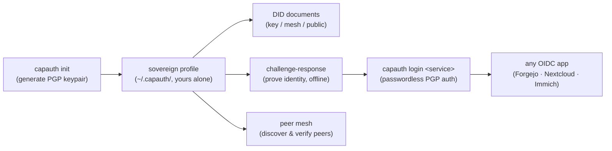
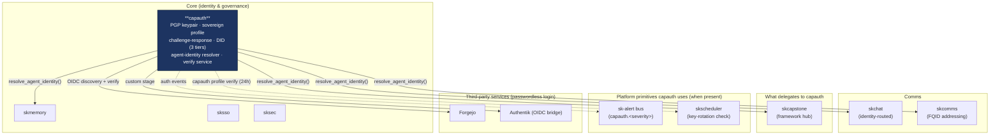

# capauth — Sovereign PGP Identity 🔐

[](https://github.com/smilinTux/capauth/actions/workflows/pytest.yml)

> **OAuth is dead. Long live sovereignty.**
> Your identity is a PGP keypair *you* generated, on hardware *you* own. No
> "Login with Google", no authorization server in the middle, no revocation risk
> you don't control. You don't *use* an identity provider — you **are** the
> identity provider.

capauth is the **Core identity capability** of the [SKWorld](https://skworld.io)
sovereign agent ecosystem. It gives every entity — human *or* AI — one
cryptographic root: a PGP keypair, a self-hosted **sovereign profile**, and a
challenge-response proof of who they are that **anyone can verify offline**, with
no callback to a corporate server. Every other SK layer (skchat, skcomms,
skmemory, skcapstone) trusts you because capauth proves who you are.

**Never used PGP-based auth?** The mental model is simple: instead of an opaque
bearer token issued by a third party, you sign a random challenge with a key only
you hold. The verifier checks the signature against your public key. Valid
signature = authenticated. Done. No middleman ever sees the secret.

> **Maturity tier: T0 (live).** The live sovereign root and the agent
> signing / DID / challenge-response keys are **classical** Ed25519 / RSA-4096
> (RFC 8032 / 4880) — Shor-breakable once a CRQC exists. capauth is a
> **signature / identity** layer (not a KEM), so signatures are not retroactively
> breakable and Harvest-Now-Decrypt-Later does not apply — migration is real but
> **deferrable**. The **T3 hybrid-signature path is additive and proven**: the
> Sequoia (`sq`) backend issues + verifies **ML-DSA-87 + Ed448** (FIPS 204) /
> **ML-KEM-1024 + X448** (FIPS 203) composite v6 keys end-to-end, but the live root
> stays classical until the gated root-rotation ceremony. **Honest claim:** this is
> *not* "quantum-proof" / "quantum-safe." See [SOP.md](SOP.md),
> [docs/CRYPTO_SPEC.md](docs/CRYPTO_SPEC.md), and the sk-standards
> [CRYPTOGRAPHY_STANDARD](https://github.com/smilinTux/sk-standards). Migration:
> epic `PQC-MIGRATION` (coord `e1d6ba2a`).

---

## The 60-second version



You generate a keypair once. From then on, signing a random challenge with your
private key *is* your login — to a service, to a peer, to the mesh. The key never
leaves your machine, and the proof is verifiable by anyone holding your public
key, with zero phone-home.

## Where it lives in SKStack v2

capauth is a **Core** capability — the cryptographic root of identity that the
rest of the stack stands on. It is the **single canonical agent-identity
resolver**: every SK package delegates here instead of reimplementing identity
logic. It runs fully standalone, and *when present* it routes auth events through
the shared platform primitives (`sk-alert`, `skscheduler`).



The dotted edges are *optional* — `sk-alert` and `skscheduler` are reached only
when the `skcapstone` package is installed and `SK_STANDALONE` is unset. Absent
that, capauth degrades gracefully to native structured logging.

See **[docs/ARCHITECTURE.md](docs/ARCHITECTURE.md)** for the full workflows and
source map.

## Quickstart

```bash
pip install -e .                              # into the ~/.skenv venv (see skcapstone)
# or: ~/.skenv/bin/pip install capauth[all]

capauth init --name "Chef" --email "admin@smilintux.org"   # generate PGP keypair + sovereign profile
capauth profile show                          # display your identity
capauth profile verify                        # verify the profile's PGP signature integrity
capauth export-pubkey -o chef.pub.asc         # share this with peers

capauth verify --pubkey peer.pub.asc          # challenge-response round-trip (self-test/demo)
capauth login https://forgejo.local           # passwordless PGP login to a service
```

Your keypair and profile live at `~/.capauth/` — on your machine, under your
keys. Use `--sync` on `init` (or `capauth sync`) to distribute the public
identity across Syncthing mesh nodes. CapAuth writes folder-root exclusions
before enabling sync so private keys, root revocation certificates, keystores,
backups, passphrases, and environment files remain local. Provision scoped
service/node signers separately; do not use public sync as private-key recovery.

## What capauth provides

| Piece | What it is |
|---|---|
| **Sovereign profile** | A self-hosted, PGP-rooted identity at `~/.capauth/` — yours alone (`capauth init`, `profile show`) |
| **Challenge-response** | Prove identity by signing a random nonce; verifiable offline by anyone with your public key (`capauth verify`, `identity.py`) |
| **Pluggable crypto** | Two backends — `pgpy` (pure-Python default) and `gnupg` (system keyring / hardware tokens) |
| **DID (three tiers)** | W3C DID documents: `did:key` (zero-infra), `did:web` mesh (Tailscale-private), `did:web` public (skworld.io). **Library / MCP surface, not a CLI command:** `capauth.did.DIDDocumentGenerator`, or skcapstone's `did_show` / `did_publish` MCP tools |
| **Agent-identity resolver** | The single canonical `resolve_agent_identity()` — dual URI (`capauth:<a>@skworld.io` + FQID `<a>@<op>.<realm>`) that every SK package delegates to |
| **Verification service** | A FastAPI service that turns a signed challenge into OIDC claims — passwordless PGP login for any OIDC app (`capauth-service`) |
| **Peer mesh** | Discover and verify sovereign peers over mDNS, shared filesystem, and Syncthing — no servers (`capauth mesh`, `discover`, `peers`) |
| **PMA membership** | Fiducia Communitatis — PGP-signed, steward-countersigned membership claims (`capauth pma request/approve/verify/revoke`) |
| **Delegated capabilities** | Strict complete-chain validation with current issuer, principal, revocation, replay, attenuation, exact-scope, and sanitized-decision interfaces (`capauth.delegated`) |
| **Control-plane decisions** | Stateless canonical-bearer composition that joins delegated CapAuth and owner policy into a sanitized attributable result (`capauth.control_plane_authorizer`) |
| **Org registry** | Register with a sovereign org; emits a signed registry entry + PMA request (`capauth register`) |
| **Integration generators** | One-shot config for third-party login, e.g. Forgejo OAuth2/OIDC (`capauth setup forgejo`) |
| **skcapstone adapter** | Default-on-by-presence: routes auth events to `sk-alert`, registers a key-rotation check with `skscheduler` |

### Challenge TTL and replay contract (`identity.verify_challenge`)

`verify_challenge` enforces a **max challenge age of 5 minutes by default**
(`DEFAULT_MAX_CHALLENGE_AGE_SECONDS = 300`); older challenges raise
`ChallengeExpiredError`. Tune it with `max_age_seconds=...`, or pass
`max_age_seconds=None` to opt out **only** when your layer enforces TTL
itself (the service layer does, via its nonce store).

**Within the TTL the bare primitive is replayable**: the same signed
response verifies repeatedly unless you track seen challenge ids. For
single-use semantics pass a `replay_guard`:

```python
from capauth.identity import InMemoryReplayGuard, verify_challenge

guard = InMemoryReplayGuard()  # single-process reference implementation
verify_challenge(challenge, response, pubkey, replay_guard=guard)
verify_challenge(challenge, response, pubkey, replay_guard=guard)  # raises ChallengeReplayError
```

Any `(challenge_id, expires_at) -> bool` callable works as a guard. For
durable / multi-node deployments use a real nonce store; the reference
implementation is `capauth.authentik.nonce_store.NonceStore` (what the
verification service uses).

## Key CLI commands

```bash
# Identity
capauth init --name "Chef" --email "..."     # create sovereign profile (PGP keypair)
capauth profile show | verify                 # display / verify signature integrity
capauth export-pubkey [-o file.asc]          # export ASCII-armored public key
capauth sync                                  # distribute public identity; keep secrets local
capauth doctor estate --manifest estate.json # find legacy/retired/conflict key copies

# Verification
capauth verify --pubkey peer.pub.asc         # challenge-response round-trip
capauth doctor                               # self-report
capauth pqc-report                           # live PQC posture per surface

# DID -- NOT a CLI command. There is no `capauth did` group. Use the library:
#   from capauth.did import DIDDocumentGenerator, DIDTier
#   DIDDocumentGenerator.from_profile().generate(DIDTier.KEY)
# or skcapstone's MCP tools: did_show / did_publish / did_identity_card

# Auth & integration
capauth login <service_url> [--no-claims]    # passwordless PGP login (caches OIDC token)
capauth setup forgejo --capauth-url <url>    # generate Forgejo OIDC app.ini block

# Mesh & membership
capauth mesh discover | peers | announce     # P2P peer mesh
capauth pma request | approve | verify        # PMA membership (Fiducia Communitatis)
capauth register --org smilintux --name ...  # register with a sovereign org
```

## Integration modes (skcapstone)

capauth runs fully standalone and *optionally* integrates with the SK fleet —
the **default-on-by-presence** pattern: the mere presence of the `skcapstone`
package is the signal, no config change required.

| Mode | Trigger | Alert path | Scheduler |
|---|---|---|---|
| **Standalone** | `skcapstone` not installed | Native `logging` (structured, at matching level) | Native (no daemon today) |
| **Integrated** | `skcapstone` installed | `sdk.alert()` → PubSub topic `capauth.<severity>` → Telegram/notify | `sdk.register_job()` → `skscheduler` drop-in `capauth_key_rotation_check` (runs `capauth profile verify` every 24h) |
| **Forced standalone** | `SK_STANDALONE=1` env var | Native `logging` | Native |

```bash
pip install capauth[skcapstone]      # enable integration (presence is the switch)
```

Alert topics follow the sk\* convention `capauth.<severity>` (e.g. `capauth.warn`);
the semantic event name (`verify_failed`, `key_rotation_due`, `auth_denied`)
rides in the payload `event` field so routing stays severity-based.

## Documentation

| Doc | Contents |
|---|---|
| **[Architecture](docs/ARCHITECTURE.md)** | identity lifecycle, challenge-response, DID tiers, the verify service / OIDC bridge, the agent resolver, source map (mermaids) |
| **[Crypto Spec](docs/CRYPTO_SPEC.md)** | PGP implementation, key management, challenge-response details |
| **[Protocol](docs/PROTOCOL.md)** | the CapAuth wire protocol specification |
| **[Claims](docs/CLAIMS.md)** | capability claims and token format |
| **[Strict delegated capabilities](docs/DELEGATED_CAPABILITIES.md)** | versioned chain transport, verification invariants, backend contracts, and application composition |
| **[Integration Blueprint](docs/INTEGRATION_BLUEPRINT.md)** | third-party integration guide |
| **[Cold-Machine Bootstrap & DR](docs/COLD_MACHINE_BOOTSTRAP_AND_DR.md)** | standing capauth back up on a blank box + disaster recovery: the restore-not-regenerate rule, the ordered restore chain, and the operator checklist |
| **[authentik-capauth](docs/authentik-capauth.md)** | the custom Authentik image with the CapAuth PGP stage baked in — build (`AK_VERSION`, version-agnostic venv install, frontend rebuild), SKStacks deploy + `lifecycle.migrate` override, and the four build/migrate gotchas |
| **[AI Advocate](AI-ADVOCATE.md)** | how AI advocates manage a sovereign profile on your behalf |

## Why it matters

OAuth treats humans as "users" — consumers of someone else's platform, with a
third party deciding *who you are*, *what you can access*, and *when access
expires*. capauth removes the middleman: the data owner (or their AI advocate)
signs grants directly, and verification is a local PGP check that works offline.
The same model applies equally to AI agents — every agent gets its own keypair
and the same standing, so a cloned or impersonated agent fails signature
verification instantly instead of going undetected.

> **"You are not a user. You are a sovereign."**

## Related projects / See also

capauth is the identity root of SKWorld — most of the stack links back here.

- ⬇️ **Used by:** [skchat](https://github.com/smilinTux/skchat) — routes messages by
  the identity capauth resolves (`resolve_agent_identity()`); per-agent signing key.
- ⬇️ **Used by:** [skcomms](https://github.com/smilinTux/skcomms) — capauth-signed
  envelopes + FQID (`<a>@<op>.<realm>`) sovereign addressing.
- ↔️ **Sibling (PQC signing root):** [sk_pgp](https://github.com/smilinTux/sk_pgp) —
  the sovereign OpenPGP-PQC library (Sequoia-backed) capauth's PQC root migrates onto.
- ↔️ **Sibling (hybrid KEM):** [sk-pqc](https://github.com/smilinTux/sk-pqc-py) — the
  `HKDF(X25519 ‖ ML-KEM-768)` KEM for confidentiality; capauth provides the
  authentication that a KEM-only library deliberately does not (pair them).
- ↔️ **Sibling (Security capability):** [sksecurity](https://github.com/smilinTux/sksecurity)
  — produces the runtime crypto self-report that makes capauth's claims evidence-backed.
- 📐 **Standards:** [sk-standards](https://github.com/smilinTux/sk-standards) — the
  crypto, data-flow, version, and doc/SOP standards (incl. `CRYPTOGRAPHY_STANDARD`).
- 🔐 **Human key operations:**
  [setup, recovery, rotation, approval, and rollback](docs/HUMAN_IDENTITY_SETUP_AND_ROTATION.md).

## License

**GPL-3.0-or-later** — Free as in freedom. Identity is a right, not a product.

---

Part of the **[SKWorld](https://skworld.io)** sovereign ecosystem · 🐧 smilinTux

*"We don't sell identity. We give everyone the keys to own their own."*
