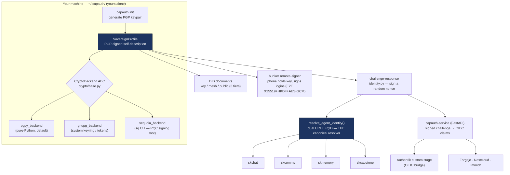
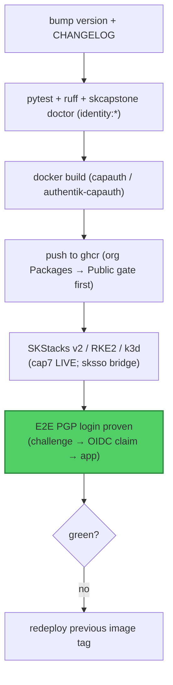

# capauth — Standard Operating Procedures

`capauth` is the **sovereign PGP identity** capability of SKWorld: every entity
(human or AI) is rooted in a PGP keypair *it* holds, proves itself by signing a
random challenge (offline-verifiable, no auth server), publishes **W3C DID**
documents at three privacy tiers, and is the **single canonical agent-identity
resolver** the rest of the stack delegates to. It ships as a Python library + a
`capauth` CLI + a FastAPI verification service (PGP-SSO / OIDC bridge).

**Maturity tier:** **T0 today** — the live sovereign root and the agent
signing / DID / challenge-response / key-wrap keys are **classical** Ed25519 /
RSA-4096 (RFC 8032 / 4880), therefore **Shor-breakable** once a CRQC exists.
capauth is a **signature / identity** layer (not a KEM), so signatures are **not**
retroactively breakable and Harvest-Now-Decrypt-Later does **not** apply to it —
migration is real but deferrable. The **T3 hybrid-signature path is additive and
proven**: the Sequoia (`sq`) PQC OpenPGP signing backend (`crypto/sequoia_backend.py`)
issues **ML-DSA-87 + Ed448** (FIPS 204, NIST L5) / **ML-KEM-1024 + X448** (FIPS 203)
composite keys on OpenPGP v6 (RFC 9580 / draft-ietf-openpgp-pqc-17) and has been
verified end-to-end through capauth, but the **live root stays classical until the
gated root-rotation ceremony**. Migration tracked under epic `PQC-MIGRATION`
(coord `e1d6ba2a`). Per-surface inventory: [docs/CRYPTO_SPEC.md](docs/CRYPTO_SPEC.md).

**CRYPTOGRAPHY_STANDARD compliance:** capauth conforms to the sk-standards
[CRYPTOGRAPHY_STANDARD](https://github.com/smilinTux/sk-standards) — algorithm
agility via the `models.Algorithm` enum (additive suite-ids per NIST CSWP 39), a
`CryptoBackend` ABC (`crypto/base.py`) with vetted backends (PGPy / GnuPG /
Sequoia — **no hand-rolled primitives**), honest surface-scoped claims, and the
**hybrid combiner is `HKDF(X25519_ss ‖ MLKEM768_ss)` — never XOR, never pure-PQ**
(the ML-KEM-768 + X25519 key-wrap target). Live primitives are reportable via
`capauth pqc-report` and `capauth doctor` (see section 7); there is **no `capauth did`
CLI group**, the identity card is a library / MCP surface (section 7).

**Standards anchored:** RFC 4880 / RFC 9580 (OpenPGP), RFC 7748 (X25519), RFC 8032
(Ed25519), FIPS 203 (ML-KEM), FIPS 204 (ML-DSA), FIPS 205 (SLH-DSA), W3C DID-core,
OIDC, NIST CSWP 39 (crypto-agility). **License:** GPL-3.0-or-later (legacy —
recorded, not relicensed). **Python:** ≥ 3.11.

---

## 1. Overview

**What capauth owns:**

- The **sovereign profile** — a PGP-rooted identity at `~/.capauth/`, yours alone.
- **Challenge-response** — prove identity by signing a random nonce; verifiable
  offline by anyone holding the public key, with **zero phone-home**.
- **DID (three tiers)** — `did:key` (zero-infra), `did:web` mesh (Tailscale-private),
  `did:web` public (skworld.io).
- The **single canonical agent-identity resolver** (`resolve_agent_identity()`,
  dual URI `capauth:<a>@skworld.io` + FQID `<a>@<op>.<realm>`) that skchat, skcomms,
  skmemory, and skcapstone delegate to instead of reimplementing identity.
- The **verification service** — FastAPI app that turns a signed challenge into OIDC
  claims (passwordless PGP login for any OIDC app: Forgejo, Nextcloud, Immich), plus
  the **Authentik custom stage** and the **bunker remote-signer** (phone holds the
  key and signs logins).
- **Peer mesh, PMA membership, org registry.**

**What capauth explicitly does NOT do:**

- It is **not a KEM/transport** — it authenticates, it does not establish bulk
  session secrets (that is `sk_pqc` / TLS). HNDL is out of its threat surface.
- It does **not** ship a post-quantum *live root* yet — the proven PQC backend is
  available but the live root is classical until the gated ceremony.
- It does **not** store other services' secrets, run an authorization server, or
  phone home for verification.

---

## 2. Architecture

### Identity lifecycle + delegation



### Challenge-response (the auth primitive)

```mermaid
sequenceDiagram
    autonumber
    participant V as Verifier
    participant P as Prover (holds private key)
    V->>P: challenge = random nonce (create_challenge)
    P->>P: respond_to_challenge(nonce, passphrase)<br/>detached PGP signature over the nonce
    P-->>V: ChallengeResponse (signature + claimed pubkey/fp)
    V->>V: verify_challenge(nonce, signature, public_key)
    Note over V: valid signature == authenticated.<br/>No middleman ever sees the secret; works offline.
```

Bind-mounts / data: identity lives at `~/.capauth/`; DID tiers write
`~/.skcapstone/did/key.json` (T1), `~/.skcomms/well-known/did.json` (T2, Tailscale
Serve), and Cloudflare KV (T3). The verification service listens on
**`127.0.0.1:8420` by default** (`src/capauth/service/server.py`); see section 5 for
the three deployment shapes and which one your node actually runs.
Source map + full flows: [docs/ARCHITECTURE.md](docs/ARCHITECTURE.md).

### Start here (entry-point files)

| File | Why it is an entry point |
|---|---|
| `src/capauth/cli.py` | the `capauth` console script (`capauth.cli:main`); the click group whose 16 top-level commands are the entire CLI surface |
| `src/capauth/service/server.py` | the `capauth-service` console script; owns the `127.0.0.1` / `8420` defaults and the 0.0.0.0 startup warning |
| `src/capauth/service/app.py` | the FastAPI app: every HTTP route, including `POST /v1/authz/decide` and `GET /capauth/v1/status` |
| `src/capauth/identity.py` | the auth primitive itself: create / respond to / verify a challenge |
| `src/capauth/did.py` | `DIDDocumentGenerator`, `DIDTier`, `DIDContext`; all three DID tiers plus the identity card |

---

## 3. Build

`capauth` is a Python package (library + `capauth` CLI + `capauth-service`), plus a
container image (`Dockerfile`) and the Authentik-custom image
(`Dockerfile.authentik-capauth`).

```bash
pip install -e ".[all]"          # into the ~/.skenv venv (see skcapstone)
# build the wheel/sdist:
python -m pip install --upgrade build && python -m build
# container:
docker build -t capauth .
# Authentik-custom (PGP stage baked in) — see docs/authentik-capauth.md:
docker build -f Dockerfile.authentik-capauth -t authentik-capauth .
```

Backends: `pgpy` (default, no system deps); `gnupg` needs system `gpg2`; the
**PQC signing** backend needs the `sq` CLI (Sequoia, built with the PQC feature —
see project memory `sequoia-pqc-backend-build`).

---

## 4. Test

```bash
python -m pytest tests/ -v --tb=short --cov=capauth    # exactly what CI runs
ruff format --check src/ tests/ && ruff check src/     # exactly what CI lints
```

Use `python -m pytest`, not bare `pytest`: the `src/` layout plus a sibling `capauth`
directory on the path can otherwise import the wrong package. Note the lint gate is
**ruff only** (pinned `ruff==0.15.4` in CI). `[tool.black]` is still in
`pyproject.toml` but **black is not run by CI**, so do not treat it as a gate.

| Suite | Covers |
|---|---|
| `tests/test_identity*` | challenge-response sign/verify round-trip + tamper rejection |
| `tests/test_did*` | three-tier DID generation; private-key-never-touched invariant; no Tailscale `100.x` IP leaks; tier-3 `publish_to_skworld` gate |
| `tests/` resolver | `resolve_agent_identity()` dual-URI / FQID; operator-vs-agent; no `@capauth.local` placeholders (locked by `skcapstone doctor` `identity:*`) |
| `tests/` pqc | PQC root works **end-to-end** through capauth (Sequoia v6 composite); honest PQC representation for v6 roots (no false RSA label) |
| `tests/` service | signed challenge → OIDC claims; Authentik stage flow |

The green-bar gate that blocks release: `.github/workflows/ci.yml`, which runs the
pytest job across Python 3.10 / 3.11 / 3.12 (no `|| true`, no `continue-on-error`),
the ruff lint job, and a `python -m build` + `twine check` job. A second workflow
`.github/workflows/pytest.yml` is **narrower and cannot substitute for it**: it
`--ignore`s `tests/test_integration.py`, `--deselect`s four known-failing tests, and
its `integration` job is `continue-on-error: true`, so that job is red-tolerant by
design. `ci.yml` is the honest gate. Add the `skcapstone doctor` identity invariants
on top when the change touches the resolver.

The Python 3.10 leg is a supported compatibility boundary, not an advisory job.
Shared modules must use `typing_extensions` for post-3.10 typing features and
portable UTC and string-enum definitions. A new feature is not releasable if
importing it breaks a supported matrix interpreter.

---

## 5. Release / Deploy

**Library:** bump `version` in `pyproject.toml`, add a `CHANGELOG.md` entry, run the
test gate, `python -m build`, tag `vX.Y.Z`, push.

**Verification service / Authentik bridge (deploy):**



The Authentik-custom image has four known build/migrate gotchas (imghdr/py3.14,
2-step flow state, enroll-before-verify, `lifecycle.migrate` override + worker
required for blueprints) — see [docs/authentik-capauth.md](docs/authentik-capauth.md).

**The root-rotation ceremony** (classical → PQC live root) is a **gated, owner-only**
deploy with Chef's real key — see [docs/ROOT_ROTATION_CEREMONY.md](docs/ROOT_ROTATION_CEREMONY.md)
and [docs/PQC_ROOT_MIGRATION.md](docs/PQC_ROOT_MIGRATION.md). It is additive and
reversible; classical keys are not removed while interop is in flux.

### Disaster recovery / cold-machine bootstrap

Standing capauth back up on a blank box, or recovering from key loss / compromise,
follows a **fixed, non-negotiable restore order** (skvault is sealed to the root, so
the root key must come from offline custody first, then gpg-agent, then the vault,
then the identity homes). The full ordered procedure, the DR paths (root vs
single-agent vs key-loss), and a top-to-bottom operator checklist are the runbook:
**[docs/COLD_MACHINE_BOOTSTRAP_AND_DR.md](docs/COLD_MACHINE_BOOTSTRAP_AND_DR.md)**
(coord `d7dca00c`). Every step that touches secret key material is marked
`REQUIRES CHEF`; no secret is written into the runbook.

> **The one rule: RESTORE, do not regenerate.** Every private key, profile, and
> fingerprint a consumer is already enrolled against must come back byte-identical
> from the sovereign backup. Minting a fresh keypair for an agent that already had
> one forks its identity and silently breaks every enrolled consumer.

**Provision guard (`scripts/provision_agent_profiles.py`).** This is the one command
in the tree that can mint a fresh agent keypair, so it is **guarded closed**: it
refuses to generate a key for a missing profile unless `--allow-new-keys` is passed
explicitly (and prints a loud identity-forking warning). A no-flag run is safe on a
restore: it only reads existing fingerprints and rewrites the derived `identity.json`
dual-URI fields (`capauth_uri`, `fqid`), never minting.

```bash
python scripts/provision_agent_profiles.py --dry-run   # preview, writes nothing
python scripts/provision_agent_profiles.py             # restore-safe: identity.json only
python scripts/provision_agent_profiles.py --allow-new-keys   # ONLY for a genuinely new agent
```

### Front-end / Exposure

Per [sk-standards `UNIFIED_INGRESS_STANDARD.md`](https://github.com/smilinTux/sk-standards/blob/main/standards/UNIFIED_INGRESS_STANDARD.md).
capauth has more than one deployment shape, and they have very different exposure.
**Scenario A is what a fleet node actually runs today.** Do not read the cluster
scenario as a description of your box.

#### Scenario A (default, and what runs on the fleet node): loopback PDP, no ingress

- **Tier:** **loopback only. No public `:443` route, no tunnel, no reverse proxy.**
- **What runs:** a plain console script under a user systemd unit, not a container
  and not a cluster workload:

  ```
  unit         capauth-authz.service        (systemd --user)
  ExecStart    ~/.skenv/bin/capauth-service --host 127.0.0.1 --port 8420
  drop-in      capauth-authz.service.d/restart-storm.conf  (SERVICE_UNIT_STANDARD Tier A backoff)
  gate         CAPAUTH_AUTHZ_TOKEN from ~/.config/capauth/authz-service.env
               (unset = the decide endpoint answers 503 / disabled)
  ```

  Verify the EFFECTIVE command, not the fragment, because drop-ins can rewrite it:
  `systemctl --user show capauth-authz.service -p ExecStart -p DropInPaths`.
- **Consumer:** skgateway's PEP, co-located on the same node, calling
  `POST /v1/authz/decide` (`src/capauth/service/app.py:553`). Loopback is the
  network-layer gate, the bearer token is the application-layer gate.
- **Bind address:** `127.0.0.1:8420`. **These are the code defaults**, not just the
  unit's flags: `--host` defaults to `"127.0.0.1"` and `--port` to `8420` in
  `src/capauth/service/server.py`. Passing `0.0.0.0` still works but prints a
  **startup WARNING** (`server.py:50-53`) because capauth is a PDP and must never
  sit on a public interface.
- **Self-report / liveness:** `GET /capauth/v1/status` (`app.py:395`).
  **There is no `/health` route.** Do not add one to a monitor config expecting 200.

#### Scenario B (optional, repo-provided): standalone container

`deploy/capauth-service/docker-compose.yml` publishes `${CAPAUTH_PORT:-8420}:8420`
from `ghcr.io/smilintux/capauth:latest`, with a healthcheck that curls
`/capauth/v1/status`. Note that a compose `ports:` mapping binds all interfaces by
default: constrain it to `127.0.0.1:8420:8420` or a tailnet address unless something
else terminates ingress.

#### Scenario C (elsewhere in the fleet, NOT deployed from this repo): the SSO bridge

The Authentik PGP-SSO bridge (`authentik-capauth` + the `capauth-service` OIDC IdP)
and the bunker remote-signer relay are documented as running behind a Cloudflare
Tunnel at `capauth-skstack41.skworld.io` (see
[docs/CAPAUTH_BUNKER_REMOTE_SIGNER.md](docs/CAPAUTH_BUNKER_REMOTE_SIGNER.md) and
[docs/AUTHENTIK_DEPLOYMENT_SKSSO.md](docs/AUTHENTIK_DEPLOYMENT_SKSSO.md)). If that is
live it is a separate deployment: **this repository contains no Kubernetes manifest,
no Traefik label, and no tunnel config for it.** The routes those docs describe are
`GET /.well-known/openid-configuration`, `GET /.well-known/jwks.json`,
`POST /capauth/v1/challenge`, `POST /capauth/v1/verify`, `GET /capauth/v1/status`,
`GET /capauth/v1/callback`, plus `POST /bunker/session`, `WS /bunker/ws`
(`app.py:1525`) and the phone PWA under `/bunker/`. All of those handlers do exist in
`src/capauth/service/app.py`; what is unverified from this repo is that any cluster is
currently serving them. Treat the hostnames as claims to confirm against the live
tunnel before you rely on them.

---

## 6. Configuration / Usage

| Knob | Where | Effect |
|---|---|---|
| `~/.capauth/` | filesystem | the sovereign profile + keys (yours alone) |
| `~/.capauth/config.yaml` `publish_to_skworld` | config | gates tier-3 public DID publication |
| `--sync` / `capauth sync` | CLI | replicate the identity across Syncthing mesh nodes |
| `SK_STANDALONE=1` | env | force standalone (ignore skcapstone integration) |
| backend select | `get_backend("pgpy"\|"gnupg"\|"sequoia")` | choose crypto backend |
| `~/.skcapstone/cluster.json` | config | `realm` / `operator` for the FQID half of the resolver |

**Never inline a live secret.** Passphrases are prompted / sourced from the agent
unlock hook (gpg-agent / skvault); the private key never leaves the machine and is
never embedded in a DID document.

---

## 7. API / Reference

**CLI.** The `capauth` entry point is `capauth.cli:main` (`pyproject.toml`
`[project.scripts]`), a `click` group. Its **complete** set of top-level commands is:

```
discover  doctor  export-pubkey  init  login  manifest  mesh  peers
pma  pqc-report  profile  register  setup  sync  token  verify
```

```bash
capauth init --name "Chef" --email "..."     # create sovereign profile (PGP keypair)
capauth profile show | verify                # display / verify signature integrity
capauth export-pubkey [-o file.asc]          # export ASCII-armored public key
capauth verify --pubkey peer.pub.asc         # challenge-response round-trip
capauth login <service_url>                  # passwordless PGP login (caches OIDC token)
capauth setup forgejo --capauth-url <url>    # generate Forgejo OIDC app.ini block
capauth mesh discover | peers | announce     # P2P peer mesh
capauth pma request | approve | verify       # PMA membership (Fiducia Communitatis)
capauth register --org smilintux --name ...  # register with a sovereign org
capauth doctor                               # self-report
capauth doctor custody [--json-out]          # key-custody / backup-age self-report
capauth pqc-report                           # live PQC posture per surface
capauth manifest sign | verify | list        # signed module manifests
capauth token mint-audience ...              # mint an audience-scoped token
```

### Authorization token incident check

`capauth.authz.decide()` is fail-closed on token authenticity: a granting token
must have a non-empty signature, `signature_verifies()` must succeed, it must be
active, and its token ID must not appear in
`$SKCAPSTONE_HOME/security/revoked-tokens.json`. Never infer trust from the
persisted `verified` field alone. `issue_token()` must also abort before storage
when signing fails; an unsigned compatibility token may only pass through the
explicit, bounded legacy-grace configuration documented in `authz.py`.

For an incident sweep, inventory the token payloads in
`$SKCAPSTONE_HOME/security/tokens/`, confirm every live grant has a detached
signature, search the revocation list for the reported token ID, and exercise
both controls: an unsigned/tampered token is denied while a valid signed token
is allowed. Revoke a discovered token through `capauth.tokens.revoke_token()`;
do not delete the evidence file by hand. Preserve the test evidence from
`tests/test_authz_signature_gate.py` and `tests/test_authz_legacy_grace.py` on
the coordination card.

> **There is NO `capauth did` command group.** Earlier revisions of this SOP and of
> the README documented `capauth did generate` and `capauth did identity-card`; both
> are fabrications, and running them exits non-zero with "No such command". The DID
> surface is reachable two real ways:
>
> - **Library** (`src/capauth/did.py`): `DIDDocumentGenerator.from_profile()` then
>   `.generate(DIDTier.KEY | WEB_MESH | WEB_PUBLIC)` (`:352`), `.generate_all()`
>   (`:391`), or `.generate_identity_card()` (`:421`).
> - **MCP tools shipped by skcapstone**, not by capauth:
>   `did_show`, `did_publish`, `did_identity_card`
>   (`skcapstone/src/skcapstone/mcp_tools/did_tools.py`).

**Python:**

```python
from capauth import resolve_agent_identity, SovereignProfile
ident = resolve_agent_identity("lumina")     # None → active agent via SKAGENT
ident.capauth_uri   # 'capauth:lumina@skworld.io' (wire identity; always present)
ident.fqid          # 'lumina@chef.skworld'       (agent@operator.realm)
ident.fingerprint   # 40/64-char PGP fp (None if placeholder)
```

```python
from capauth.did import DIDDocumentGenerator, DIDTier
gen  = DIDDocumentGenerator.from_profile()   # reads ~/.capauth/ (public key only)
doc  = gen.generate(DIDTier.KEY)             # tier 1; WEB_MESH / WEB_PUBLIC for 2 / 3
card = gen.generate_identity_card()          # LOCAL-ONLY artifact, never published
```

**HTTP** (`src/capauth/service/app.py`, served by `capauth-service`): status
`GET /capauth/v1/status` (`:395`), challenge `POST /capauth/v1/challenge` (`:229`),
verify `POST /capauth/v1/verify` (`:266`), authz decision
`POST /v1/authz/decide` (`:553`), OIDC discovery
`GET /.well-known/openid-configuration` (`:600`) and `GET /.well-known/jwks.json`
(`:653`). **No `/health` route exists**; `/capauth/v1/status` is the liveness probe
(that is what the compose healthcheck curls).

**Trust graph.** `capauth.trust.graph.build_trust_graph` is a VISUALISATION, not
a decision input: `TrustEdge.strength` is read only by the renderers (DOT
`penwidth`, the ASCII bar, skdashboard's stroke width), and no authorization path
(`authz.py`, `tokens.py`, `service/`) imports the trust graph at all. One of its
inputs, the coordination `agents/*.json` projection, is known to be corrupt in
four measured ways and is read anyway under a `# PROJECTION-OK:` marker whose
justification depends on that separation holding. Every graph now reports per
source read health (`ok` / `absent` / `degraded` / `unreadable`) so an unreadable
input is distinguishable from a genuinely empty one. Audit, the marker's
conditions, and the proposed weighting change:
[docs/TRUST_GRAPH_COORD_PROJECTION.md](docs/TRUST_GRAPH_COORD_PROJECTION.md).

Full protocol + claim/token format: [docs/PROTOCOL.md](docs/PROTOCOL.md),
[docs/CLAIMS.md](docs/CLAIMS.md). Crypto detail: [docs/CRYPTO_SPEC.md](docs/CRYPTO_SPEC.md).

---

## 8. Troubleshooting

Human identity setup, custody recovery, rotation, signed approval, and rollback
are governed by
[docs/HUMAN_IDENTITY_SETUP_AND_ROTATION.md](docs/HUMAN_IDENTITY_SETUP_AND_ROTATION.md).
The human performs all passphrase/private-key operations; automation may only
prepare paths and verify public evidence.

| Symptom | Likely cause | Fix |
|---|---|---|
| `capauth verify` fails on a valid peer | wrong public key / stale profile | re-`export-pubkey`; confirm fingerprint matches the DID/identity card |
| resolver returns `@capauth.local` placeholder | per-agent identity file missing | run `skcapstone doctor` → fix the `identity:*` checks; ensure `cluster.json` realm/operator |
| DID document leaks a `100.x` IP | tier mis-selected | tier-2/3 strip Tailscale IPs by design — regenerate with the correct `--tier`; never hand-edit |
| PQC signing unavailable | `sq` CLI missing or built without PQC | install Sequoia `sq` with the PQC feature (see `sequoia-pqc-backend-build`); select the `sequoia` backend |
| DID shows a false `RSA` label on a v6 root | stale algorithm mapping | update to the honest v6/64-hex fingerprint representation (fixed: commit `0609800`) |
| Authentik login loops / blueprint not applied | worker not running / `lifecycle.migrate` not overridden | see the four gotchas in [docs/authentik-capauth.md](docs/authentik-capauth.md) |
| login works but no OIDC token cached | service URL / claims mismatch | re-run `capauth login <url>`; check the verification service logs |
| `capauth did ...` → "No such command 'did'" | the command does not exist; older docs invented it | use the library (`DIDDocumentGenerator`) or the skcapstone MCP tools `did_show` / `did_publish` / `did_identity_card`. See section 7 |
| `curl .../health` → 404 | there is no `/health` route | probe `GET /capauth/v1/status` instead |
| `POST /v1/authz/decide` → 503 | `CAPAUTH_AUTHZ_TOKEN` unset, so the endpoint is disabled by design | populate `~/.config/capauth/authz-service.env`, then `systemctl --user restart capauth-authz` |
| you edited capauth, rebuilt, and nothing changed | **you are in the stale duplicate checkout** | `~/clawd/capauth` is a **stale second clone** (measured 184 behind / 1 ahead / 72 dirty). The LIVE tree is `~/clawd/skcapstone-repos/capauth`, and it is what the venv actually imports. Confirm with `python -c "import capauth; print(capauth.__file__)"` and with the `__editable__.capauth-*.pth` in `~/.skenv/lib/python3.*/site-packages/`, which points at the live `src/`. Never resolve this by guessing from the directory name |
| `capauth.__version__` disagrees with the tag / PyPI | the hardcoded literal in `__init__.py` | expected, see section 9. Trust `git describe --tags --match 'v[0-9]*'`, not the literal |

---

## 9. Maturity-tier + Version reference

- **Maturity tier:** **T0** live (classical Ed25519/RSA root + surfaces) with the
  **T3 hybrid-signature path additive + proven** (ML-DSA-87+Ed448 / ML-KEM-1024+X448,
  FIPS 204/203, RFC 9580 v6) via `sequoia_backend.py`; live root migrates under the
  gated ceremony. As a signature/identity layer, **HNDL does not apply** — migration
  is real but deferrable.
- **VERSION_LIFECYCLE phase:** Active (v2).
- **Version:** **do not quote a number here, and do not trust one you find in the
  tree.** `pyproject.toml` declares `dynamic = ["version"]`, so **the git tag IS the
  version**, derived at build time by `setuptools-scm` under
  `[tool.setuptools_scm]`, restricted to release tags by
  `tag_regex = "^v(?P<version>[0-9]+\.[0-9]+\.[0-9]+)$"` (the repo also carries
  non-semver tags like `nextcloud-v0.3.0`, which would otherwise win). To read the
  real version: `git describe --tags --match 'v[0-9]*'`, or
  `python -c "import capauth; print(capauth.__version__)"` **from an installed
  build**, or check PyPI.
  - ⚠️ **Known drift, code follow-up, do not paper over it in docs:**
    `src/capauth/__init__.py:156` still hardcodes `__version__ = "0.2.15"`. That
    literal is stale and is not what a built wheel reports (the current editable
    install resolves to `0.2.21.dev9+...`, and the newest release tag is `v0.2.20`).
    Three sources therefore disagree. The fix belongs in `src/`, not here: make
    `__init__.py` read the installed distribution metadata instead of carrying a
    literal. Until that lands, treat `capauth.__version__` as unreliable.
- **CRYPTOGRAPHY_STANDARD compliance:** see the header line above — agility enum +
  backend ABC + honest surface-scoped claims + hybrid combiner
  `HKDF(X25519 ‖ MLKEM768)` (never XOR / never pure-PQ) + ecosystem self-report.
- **PQC migration:** epic `PQC-MIGRATION`, coord `e1d6ba2a`; master plan = skchat
  `docs/quantum-resistance-architecture.md`; standard = sk-standards
  `CRYPTOGRAPHY_STANDARD.md`.

---

**SK = staycuriousANDkeepsmilin 🐧** — *capauth: you are not a user, you are a sovereign.*

<!-- docs-evidence
verified: 2026-08-16
checks:
  - name: the trust graph is still display-only, which is what section 7 and the PROJECTION-OK marker rest on
    run: ! grep -rqE 'trust\.graph|build_trust_graph|TrustEdge' src/capauth/authz.py src/capauth/tokens.py src/capauth/service/
  - name: the coord projection read still carries its PROJECTION-OK justification
    run: grep -qF '# PROJECTION-OK:' src/capauth/trust/graph.py
  - name: coord edges still declare their count uncorroborated
    run: grep -qF '"corroborated": False' src/capauth/trust/graph.py
  - name: the coord weight constants and their saturation point are still recorded, not inline magic
    run: grep -qxF 'COORD_SATURATION_TASKS = 14' src/capauth/trust/graph.py && grep -qxF 'COORD_BASE_STRENGTH = 0.3' src/capauth/trust/graph.py
  - name: a degraded source is still reported rather than swallowed into an empty graph
    run: grep -qF 'def warnings(' src/capauth/trust/graph.py && grep -qF '"unreadable"' src/capauth/trust/graph.py
  - name: both console-script entry points are exactly as section 7 documents
    run: grep -qxF 'capauth = "capauth.cli:main"' pyproject.toml && grep -qxF 'capauth-service = "capauth.service.server:main"' pyproject.toml
  - name: capauth-service still defaults to 127.0.0.1 and port 8420 (section 5 Scenario A)
    run: grep -qE '^\s*default="127\.0\.0\.1",\s*$' src/capauth/service/server.py && grep -qE 'default=8420, type=int' src/capauth/service/server.py
  - name: a 0.0.0.0 bind still emits the documented startup WARNING
    run: grep -qE '^\s+if host in \("0\.0\.0\.0"' src/capauth/service/server.py
  - name: the two routes section 5 names still exist (status, authz decide)
    run: grep -qE '^@app\.get\("/capauth/v1/status"' src/capauth/service/app.py && grep -qE '^@app\.post\("/v1/authz/decide"' src/capauth/service/app.py
  - name: NO /health route exists, as sections 5 and 8 assert
    run: ! grep -qE '^@app\.(get|post|put|api_route|websocket)\("/health' src/capauth/service/app.py
  - name: NO capauth did command group exists, as section 7 asserts
    run: ! grep -qE "^def did\(|@main\.(group|command)\([\"']did[\"']" src/capauth/cli.py
  - name: version stays setuptools-scm derived, never a literal in pyproject
    run: grep -qxF 'dynamic = ["version"]' pyproject.toml && ! grep -qE '^version\s*=' pyproject.toml
  - name: ci.yml still runs the documented pytest gate and it cannot be short-circuited
    run: grep -qF 'python -m pytest tests/ -v --tb=short --cov=capauth' .github/workflows/ci.yml && ! grep -qE 'python -m pytest.*(\|\||;\s*true|continue-on-error)' .github/workflows/ci.yml
  - name: ci.yml lint gate is ruff (section 4 says black is NOT a gate)
    run: grep -qF 'ruff format --check src/ tests/' .github/workflows/ci.yml
-->
