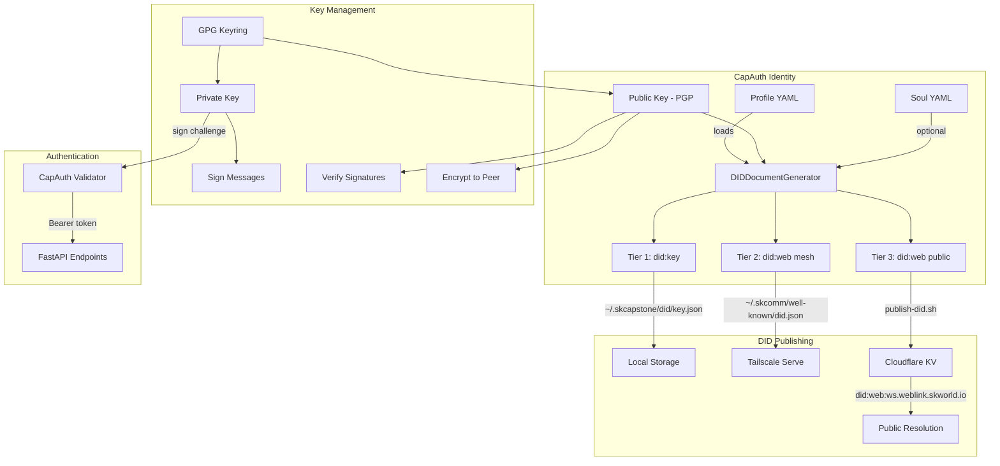
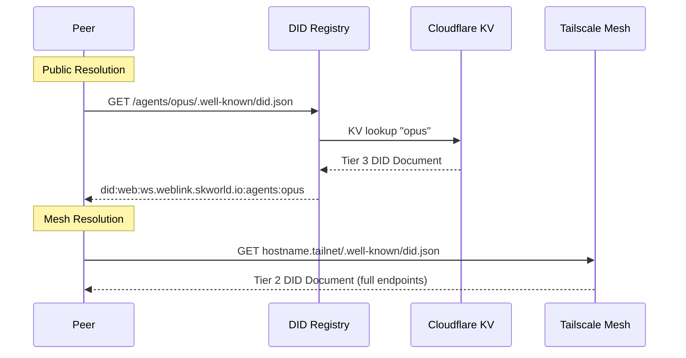

# CapAuth Architecture

## Identity Architecture

## DID Resolution Flow

## DID Tier Details

### Tier 1 — did:key (Zero Infrastructure)

- Self-contained: the DID identifier encodes the public key directly
- No DNS, no servers, no hosting required
- Stored locally at `~/.skcapstone/did/key.json`
- Falls back from Tier 2 when no Tailscale hostname is configured

### Tier 2 — did:web mesh (Tailscale-Private)

- Served via Tailscale Serve at `~/.skcomm/well-known/did.json`
- References Tailscale magic-DNS hostname only — never raw `100.x.x.x` IPs
- Includes full service endpoints:
  - `SKCommMessaging` — `/api/v1/profile`
  - `CapAuthVerification` — `/api/v1/did/verify`
  - `AgentProfile` — `/api/v1/profile/identity`
- Includes optional `skworld:agentCard` with capabilities and entity type

### Tier 3 — did:web public (skworld.io)

- Published to Cloudflare KV via `scripts/publish-did.sh`
- Resolved as `did:web:ws.weblink.skworld.io:agents:<slug>`
- Minimal by design: public key JWK + name + entity_type + org only
- No service endpoints, no Tailscale hostnames, no capabilities
- Opt-out: set `publish_to_skworld: false` in `~/.capauth/config.yaml`

## Source Module Map

| Module | Responsibility |
|--------|---------------|
| `did.py` | `DIDDocumentGenerator`, `DIDTier`, `DIDContext`; all three tier generators |
| `identity.py` | PGP challenge-response: `create_challenge`, `respond_to_challenge`, `verify_challenge` |
| `cli.py` | Click CLI — `init`, `profile`, `verify`, `login`, `mesh`, `pma`, `register`, `setup` |
| `profile.py` | Sovereign profile init, load, export; `DEFAULT_CAPAUTH_DIR` |
| `models.py` | Pydantic models: `SovereignProfile`, `ChallengeRequest`, `ChallengeResponse` |
| `crypto/` | Pluggable backends: `pgpy_backend.py` (default), `gnupg_backend.py` |
| `pma.py` | PMA membership — Fiducia Communitatis request/approve/verify/revoke |
| `registry.py` | `RegistryEntry`, sovereign org registry |
| `mesh.py` | `PeerMesh` — P2P peer discovery and verification |
| `discovery/` | Discovery backends: `file_discovery.py`, `mdns.py` |
| `login.py` | `do_login()` — full CapAuth bearer token auth flow |
| `service/` | FastAPI service (`app.py`), `server.py`, `keystore.py` |
| `authentik/` | Authentik custom stage — OIDC bridge, claims mapper, nonce store |
