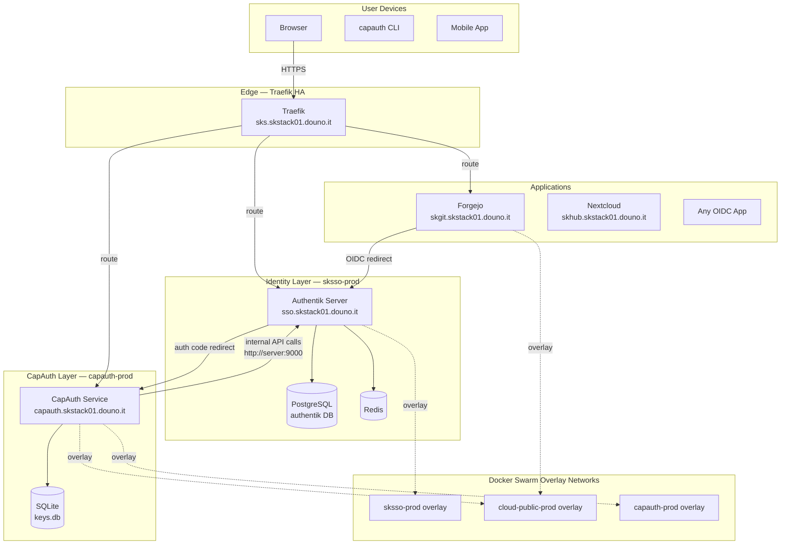
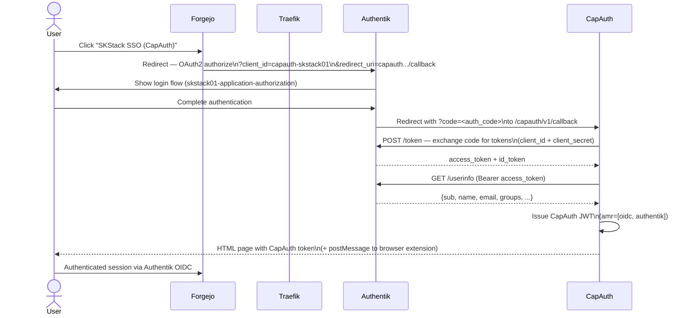
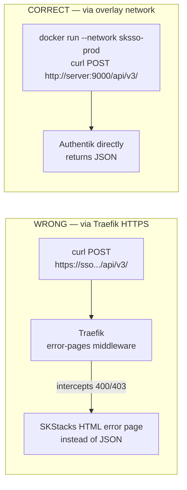
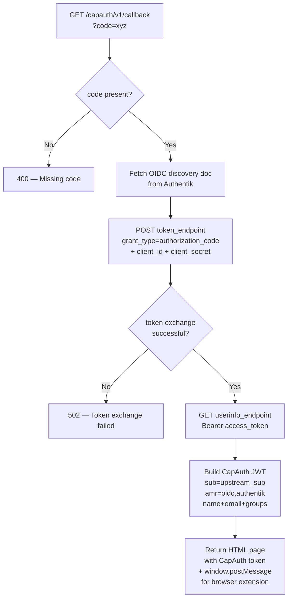

# CapAuth — Authentik & Forgejo Integration Deployment Guide

**Version:** 1.0.0 | **Date:** 2026-02-24 | **Environment:** Docker Swarm + SKStacks

This document is the authoritative step-by-step record of how CapAuth was integrated with
a live Authentik (`sksso-prod`) and Forgejo (`skgit-prod`) deployment running on a Docker
Swarm cluster. Every command is real — these were executed and verified against
`skstack01.douno.it`.

---

## Architecture Overview



---

## Auth Flow — End to End



---

## Prerequisites

| Component | Version | Location |
|-----------|---------|----------|
| Authentik | 2025.12.3 | `ghcr.io/goauthentik/server:2025.12.3` |
| Forgejo | 12 | `codeberg.org/forgejo/forgejo:12` |
| CapAuth Service | 0.1.0 | `skgit.skstack01.douno.it/skadmin/capauth-service:latest` |
| Docker Swarm | — | Manager: `norap1001`, Workers: `norap1002`, `norap1003`, `norap1011` |
| Traefik HA | — | `skfenceha-prod` stack |
| Shared FS | NFS | `/var/data/` mounted on all nodes |

---

## Part 1 — Deploy the CapAuth Verification Service

### 1.1 Build the Docker Image

```bash
# From the capauth project root
cd /path/to/smilintux-org/capauth

docker build -t skgit.skstack01.douno.it/skadmin/capauth-service:latest .
docker push skgit.skstack01.douno.it/skadmin/capauth-service:latest
```

**Dockerfile** (`capauth/Dockerfile`):

```dockerfile
FROM python:3.12-slim
WORKDIR /app
RUN apt-get update && apt-get install -y --no-install-recommends \
    gnupg2 curl && rm -rf /var/lib/apt/lists/*
COPY pyproject.toml MANIFEST.in README.md ./
COPY src/ ./src/
RUN pip install --no-cache-dir -e ".[service]"
RUN mkdir -p /data && chmod 777 /data
ENV CAPAUTH_DB_PATH=/data/keys.db
ENV CAPAUTH_SERVICE_ID=capauth.local
ENV CAPAUTH_BASE_URL=https://capauth.local
EXPOSE 8420
HEALTHCHECK --interval=30s --timeout=5s --start-period=10s --retries=3 \
    CMD curl -f http://localhost:8420/capauth/v1/status || exit 1
CMD ["capauth-service", "--host", "0.0.0.0", "--port", "8420"]
```

### 1.2 Create Required Overlay Networks

```bash
# Run on Swarm manager
docker network create --driver overlay --attachable capauth-prod
# cloud-public-prod already exists (shared with Traefik)
```

### 1.3 Create Data Directory

```bash
# On shared NFS filesystem (all nodes see this path)
sudo mkdir -p /var/data/capauth-prod/data
sudo mkdir -p /var/data/config/capauth-prod
sudo chmod 777 /var/data/capauth-prod/data
```

### 1.4 Create Environment File

```bash
sudo tee /var/data/config/capauth-prod/capauth.env > /dev/null << 'EOF'
CAPAUTH_SERVICE_ID=capauth.skstack01.douno.it
CAPAUTH_BASE_URL=https://capauth.skstack01.douno.it
CAPAUTH_ADMIN_TOKEN=<your-secure-admin-token-here>
CAPAUTH_REQUIRE_APPROVAL=false
CAPAUTH_DB_PATH=/data/keys.db

# Authentik OIDC integration (filled in Part 2)
AUTHENTIK_CLIENT_ID=capauth-skstack01
AUTHENTIK_CLIENT_SECRET=<your-client-secret>
AUTHENTIK_OIDC_DISCOVERY=https://sso.skstack01.douno.it/application/o/capauth-skstack01/.well-known/openid-configuration
EOF
```

> **Generate a secure admin token:**
> ```bash
> openssl rand -hex 32
> ```

### 1.5 Stack Definition

`capauth-io/stack.yml`:

```yaml
version: '3.8'

networks:
  capauth-prod:
    external: true
  cloud-public-prod:
    external: true

services:
  server:
    image: skgit.skstack01.douno.it/skadmin/capauth-service:latest
    environment:
      - CAPAUTH_SERVICE_ID=capauth.skstack01.douno.it
      - CAPAUTH_BASE_URL=https://capauth.skstack01.douno.it
      - CAPAUTH_DB_PATH=/data/keys.db
      - CAPAUTH_ADMIN_TOKEN=${CAPAUTH_ADMIN_TOKEN}
      - CAPAUTH_REQUIRE_APPROVAL=false
      - AUTHENTIK_CLIENT_ID=capauth-skstack01
      - AUTHENTIK_CLIENT_SECRET=${AUTHENTIK_CLIENT_SECRET}
      - AUTHENTIK_OIDC_DISCOVERY=https://sso.skstack01.douno.it/application/o/capauth-skstack01/.well-known/openid-configuration
    volumes:
      - /var/data/capauth-prod/data:/data
    deploy:
      mode: replicated
      replicas: 1
      placement:
        constraints:
          - "node.role == worker"
      labels:
        - "traefik.enable=true"
        - "traefik.swarm.network=cloud-public-prod"
        - "traefik.http.routers.capauth.rule=Host(`capauth.skstack01.douno.it`)"
        - "traefik.http.routers.capauth.entrypoints=websecure"
        - "traefik.http.routers.capauth.tls=true"
        - "traefik.http.routers.capauth.tls.certresolver=main"
        - "traefik.http.routers.capauth.middlewares=default@file"
        - "traefik.http.routers.capauth.service=capauth"
        - "traefik.http.services.capauth.loadbalancer.server.port=8420"
    networks:
      - capauth-prod
      - cloud-public-prod
    healthcheck:
      test: ["CMD", "curl", "-f", "http://localhost:8420/capauth/v1/status"]
      interval: 30s
      timeout: 5s
      retries: 3
      start_period: 15s
```

### 1.6 Deploy the Stack

```bash
# From Swarm manager
docker stack deploy \
  --compose-file capauth-io/stack.yml \
  --with-registry-auth \
  --env-file /var/data/config/capauth-prod/capauth.env \
  capauth-prod

# Verify healthy
docker service ls | grep capauth-prod
curl -s https://capauth.skstack01.douno.it/capauth/v1/status
# Expected: {"service":"capauth.skstack01.douno.it","version":"1.0.0","enrolled_keys":0,"require_approval":false,"healthy":true}
```

---

## Part 2 — Configure Authentik

### Background — Accessing the Authentik API

Authentik's API is protected by Traefik middlewares including `error-pages@file`, which
intercepts non-2xx responses and replaces them with custom HTML. This means **API POST
requests via HTTPS will appear to fail** even when Authentik processes them correctly —
the 400/403 error body gets replaced by the SKStacks error page HTML.

**The fix:** make API calls directly against Authentik's internal port over the Docker
overlay network, bypassing Traefik entirely.



### 2.1 Obtain an Authentik API Token

The `akadmin` user has an API token stored in the database. Retrieve it:

```bash
# Scale down Postgres so we can run an isolated container safely
docker service scale sksso-prod_postgres=0
sleep 10

# Start isolated Postgres against the shared data volume
CID=$(docker run -d \
  -v /var/data/runtime/sksso-prod/postgres:/var/lib/postgresql/data \
  -e PGDATA=/var/lib/postgresql/data \
  --user 999 \
  postgres:16.2)
sleep 12

# Query the token for akadmin (user id=17)
docker exec "$CID" psql -U authentik -d authentik \
  -t -c "SELECT key, intent, expiring FROM authentik_core_token WHERE user_id=17 AND intent='api';"

# Cleanup
docker kill "$CID" && docker rm "$CID"

# Bring Postgres back up
docker service scale sksso-prod_postgres=1
```

> **Important:** Always scale Postgres to 0 before attaching a second container to its
> data volume on NFS. Running two Postgres instances against the same data directory
> causes WAL corruption (`PANIC: could not locate a valid checkpoint record`).

The token is a long hex string. Export it:

```bash
export AK_TOKEN="<token-from-db-query>"
```

**Verify the token works:**

```bash
docker run --rm --network sksso-prod curlimages/curl:latest \
  curl -s -H "Authorization: Bearer $AK_TOKEN" \
  http://server:9000/api/v3/core/users/me/ | python3 -c \
  'import sys,json; d=json.load(sys.stdin); print("Logged in as:", d["user"]["username"])'
# Expected: Logged in as: akadmin
```

### 2.2 Gather Required UUIDs

Before creating resources, collect the UUIDs you'll need:

```bash
# Get authorization flows
docker run --rm --network sksso-prod curlimages/curl:latest \
  curl -s -H "Authorization: Bearer $AK_TOKEN" \
  "http://server:9000/api/v3/flows/instances/?designation=authorization" \
  | python3 -c 'import sys,json; [print(f["flow_uuid"], f["slug"]) for f in json.load(sys.stdin)["results"]]'

# Get invalidation flows
docker run --rm --network sksso-prod curlimages/curl:latest \
  curl -s -H "Authorization: Bearer $AK_TOKEN" \
  "http://server:9000/api/v3/flows/instances/?designation=invalidation" \
  | python3 -c 'import sys,json; [print(f["flow_uuid"], f["slug"]) for f in json.load(sys.stdin)["results"]]'

# Get signing keys
docker run --rm --network sksso-prod curlimages/curl:latest \
  curl -s -H "Authorization: Bearer $AK_TOKEN" \
  "http://server:9000/api/v3/crypto/certificatekeypairs/" \
  | python3 -c 'import sys,json; [print(k["kp_uuid"], k["name"]) for k in json.load(sys.stdin)["results"]]'
```

**Example output from skstack01:**

| UUID | Name / Slug |
|------|-------------|
| `97730dbd-b5fc-4171-8dce-4de5273c1db2` | `skstack01-application-authorization` (authorization flow) |
| `30b59fcb-fc7e-4acb-8f8a-80d133011827` | `default-provider-invalidation-flow` (invalidation flow) |
| `908626a5-a50c-47a1-9603-6eb7e994af75` | `authentik Self-signed Certificate` (signing key) |

### 2.3 Create the OAuth2 Provider

```bash
docker run --rm --network sksso-prod curlimages/curl:latest \
  curl -s -X POST \
    -H "Authorization: Bearer $AK_TOKEN" \
    -H "Content-Type: application/json" \
    http://server:9000/api/v3/providers/oauth2/ \
    -d '{
      "name": "capauth-skstack01",
      "authorization_flow": "97730dbd-b5fc-4171-8dce-4de5273c1db2",
      "invalidation_flow": "30b59fcb-fc7e-4acb-8f8a-80d133011827",
      "client_type": "confidential",
      "client_id": "capauth-skstack01",
      "client_secret": "capauth-sovereign-secret-2026",
      "include_claims_in_id_token": true,
      "sub_mode": "user_id",
      "issuer_mode": "per_provider",
      "access_code_validity": "minutes=1",
      "access_token_validity": "minutes=5",
      "refresh_token_validity": "days=30",
      "refresh_token_threshold": "seconds=0",
      "logout_method": "backchannel",
      "logout_uri": "",
      "signing_key": "908626a5-a50c-47a1-9603-6eb7e994af75",
      "property_mappings": [
        "c696a15e-7915-415f-be40-6b04c6f2bf95",
        "5a321312-92a4-4e92-8ae2-365b9c7f4102",
        "130cc9d5-41b2-4f9a-917f-c7e1de3816f7"
      ],
      "redirect_uris": [
        {"matching_mode": "strict", "url": "https://capauth.skstack01.douno.it/capauth/v1/callback"}
      ]
    }'
```

**Expected response** (note the `pk` — you need it for the next step):

```json
{
  "pk": 24,
  "name": "capauth-skstack01",
  "client_id": "capauth-skstack01",
  "redirect_uris": [
    {"matching_mode": "strict", "url": "https://capauth.skstack01.douno.it/capauth/v1/callback"}
  ],
  ...
}
```

> **Key API format notes** (learned from trial and error):
> - `redirect_uris` must be an **array of objects** with `matching_mode` and `url` keys — NOT a plain array of strings
> - `logout_method` valid values: `"backchannel"` — NOT `"rp_initiated"`
> - `invalidation_flow` is **required** — omitting it returns a validation error
> - `_redirect_uris` (underscore prefix) is the legacy field — use `redirect_uris` instead

### 2.4 Create the Application

```bash
# Use the pk from the provider created above (24 in our case)
docker run --rm --network sksso-prod curlimages/curl:latest \
  curl -s -X POST \
    -H "Authorization: Bearer $AK_TOKEN" \
    -H "Content-Type: application/json" \
    http://server:9000/api/v3/core/applications/ \
    -d '{
      "name": "CapAuth",
      "slug": "capauth-skstack01",
      "provider": 24,
      "policy_engine_mode": "any",
      "open_in_new_tab": false,
      "meta_description": "CapAuth - Sovereign PGP-based Passwordless Authentication",
      "meta_publisher": "SmilinTux",
      "meta_launch_url": "https://capauth.skstack01.douno.it"
    }'
```

**Expected response:**

```json
{
  "pk": "d06f934e-43af-4997-a50e-c6bb9a6fb266",
  "name": "CapAuth",
  "slug": "capauth-skstack01",
  "provider": 24,
  ...
}
```

### 2.5 Verify the OIDC Discovery Endpoint

```bash
# Internal check (from within overlay network)
docker run --rm --network sksso-prod curlimages/curl:latest \
  curl -s http://server:9000/application/o/capauth-skstack01/.well-known/openid-configuration \
  | python3 -m json.tool

# External check (via Traefik — GET requests work fine through error-pages middleware)
curl -s https://sso.skstack01.douno.it/application/o/capauth-skstack01/.well-known/openid-configuration \
  | python3 -c 'import sys,json; d=json.load(sys.stdin); print("issuer:", d["issuer"])'
# Expected: issuer: https://sso.skstack01.douno.it/application/o/capauth-skstack01/
```

**Full discovery document example:**

```json
{
  "issuer": "https://sso.skstack01.douno.it/application/o/capauth-skstack01/",
  "authorization_endpoint": "https://sso.skstack01.douno.it/application/o/authorize/",
  "token_endpoint": "https://sso.skstack01.douno.it/application/o/token/",
  "userinfo_endpoint": "https://sso.skstack01.douno.it/application/o/userinfo/",
  "jwks_uri": "https://sso.skstack01.douno.it/application/o/capauth-skstack01/jwks/",
  "scopes_supported": ["email", "openid", "profile"],
  "response_types_supported": ["code", "id_token", "code token", ...],
  "grant_types_supported": ["authorization_code", "refresh_token", ...]
}
```

---

## Part 3 — Configure Forgejo

### 3.1 Connect to the Forgejo Container

Forgejo runs on `norap1011`. The binary is at `/usr/local/bin/forgejo`.

```bash
# From Swarm manager, SSH to the worker running Forgejo
ssh holouser01@192.168.0.211

# Get the container ID
CID=$(docker ps --filter name=skgit-prod_forgejo --format "{{.ID}}" | head -1)
echo "Forgejo container: $CID"

# Verify binary location
docker exec $CID which forgejo
# Expected: /usr/local/bin/forgejo
```

### 3.2 List Existing Auth Sources

```bash
docker exec $CID forgejo admin auth list
```

### 3.3 Add Authentik as OIDC Provider

```bash
docker exec $CID forgejo admin auth add-oauth \
  --name "SKStack SSO (CapAuth)" \
  --provider openidConnect \
  --key "capauth-skstack01" \
  --secret "capauth-sovereign-secret-2026" \
  --auto-discover-url "https://sso.skstack01.douno.it/application/o/capauth-skstack01/.well-known/openid-configuration" \
  --skip-local-2fa false
```

**Verify:**

```bash
docker exec $CID forgejo admin auth list
# Expected:
# ID  Name                    Type    Enabled
# 2   SKStack SSO (CapAuth)   OAuth2  true
```

> **Note:** If updating an existing source, delete it first then recreate:
> ```bash
> docker exec $CID forgejo admin auth delete --id <ID>
> ```
> Forgejo does not have an `update-oauth` subcommand in v12.

### 3.4 What Users Will See

When Forgejo's login page loads, a **"Sign in with SKStack SSO (CapAuth)"** button
appears below the username/password form. Clicking it initiates the full OAuth2 flow
back through Authentik.

---

## Part 4 — CapAuth Service Callback Endpoint

The `/capauth/v1/callback` endpoint handles the OAuth2 authorization code redirect from
Authentik. Here's what it does:



**Key implementation detail** — the OIDC discovery URL is cached for 1 hour to avoid
hammering Authentik on every callback:

```python
_OIDC_CACHE_TTL = 3600.0

async def _get_oidc_config() -> dict:
    global _oidc_discovery_cache, _oidc_discovery_fetched_at
    now = time.time()
    if _oidc_discovery_cache and (now - _oidc_discovery_fetched_at) < _OIDC_CACHE_TTL:
        return _oidc_discovery_cache
    async with httpx.AsyncClient(timeout=10.0) as client:
        resp = await client.get(AUTHENTIK_OIDC_DISCOVERY)
        resp.raise_for_status()
        _oidc_discovery_cache = resp.json()
        _oidc_discovery_fetched_at = now
    return _oidc_discovery_cache
```

**The CapAuth JWT payload** issued after a successful Authentik OIDC callback:

```json
{
  "sub": "b1c1dfed36d647f32cf940b5c4c4ca09...",
  "iss": "capauth.skstack01.douno.it",
  "iat": 1740434067,
  "exp": 1740437667,
  "amr": ["oidc", "authentik"],
  "name": "smilinTux",
  "email": "admin@smilintux.org",
  "groups": ["authentik Admins"],
  "upstream_provider": "authentik",
  "capauth_version": "1.0"
}
```

---

## Part 5 — Updating the CapAuth Service

After code changes, rebuild, push, and force-update the running service:

```bash
# 1. Rebuild the image
cd /path/to/smilintux-org/capauth
docker build -t skgit.skstack01.douno.it/skadmin/capauth-service:latest .

# 2. Push to registry
docker push skgit.skstack01.douno.it/skadmin/capauth-service:latest

# 3. Force rolling update on the Swarm service
docker service update \
  --image skgit.skstack01.douno.it/skadmin/capauth-service:latest \
  --env-add AUTHENTIK_CLIENT_ID=capauth-skstack01 \
  --env-add AUTHENTIK_CLIENT_SECRET=capauth-sovereign-secret-2026 \
  --env-add "AUTHENTIK_OIDC_DISCOVERY=https://sso.skstack01.douno.it/application/o/capauth-skstack01/.well-known/openid-configuration" \
  --with-registry-auth \
  capauth-prod_server

# 4. Verify
curl -s https://capauth.skstack01.douno.it/capauth/v1/status
```

---

## Part 6 — Troubleshooting

### Traefik error-pages intercepts API responses

**Symptom:** POST to `https://sso.../api/v3/...` returns SKStacks HTML error page instead of JSON.

**Cause:** The `default@file` Traefik middleware chain includes `error-pages@file`, which
replaces ALL non-2xx HTTP responses with custom HTML. A 400 validation error from Authentik
becomes an HTML page.

**Fix:** Always use the internal overlay network for API calls:

```bash
docker run --rm --network sksso-prod curlimages/curl:latest \
  curl -s -X POST -H "Authorization: Bearer $AK_TOKEN" \
  -H "Content-Type: application/json" \
  http://server:9000/api/v3/... -d '{...}'
```

---

### Postgres WAL corruption after running isolated container

**Symptom:** `PANIC: could not locate a valid checkpoint record` on Postgres startup.

**Cause:** Two Postgres instances accessed the same NFS-mounted data directory simultaneously.

**Fix:**

```bash
# 1. Scale down the live service FIRST
docker service scale sksso-prod_postgres=0
sleep 10

# 2. Remove the stale lock file
docker run --rm \
  -v /var/data/runtime/sksso-prod/postgres:/var/lib/postgresql/data \
  --user 999 \
  --entrypoint sh \
  postgres:16.2 \
  -c "rm -f /var/lib/postgresql/data/postmaster.pid && echo cleared"

# 3. If still corrupt, reset the WAL
CID=$(docker run -d \
  -v /var/data/runtime/sksso-prod/postgres:/var/lib/postgresql/data \
  --user 999 postgres:16.2)
sleep 8
docker exec $CID pg_resetwal -f /var/lib/postgresql/data
docker kill $CID && docker rm $CID

# 4. Bring the live service back up
docker service scale sksso-prod_postgres=1
```

---

### Authentik akadmin password is disabled

**Symptom:** Cannot log in to Authentik admin UI, password appears as `!<hash>` in DB.

**Cause:** Django marks passwords as unusable by prepending `!`. This happens on fresh
Authentik installs where the bootstrap token is used instead of setting a real password.

**Fix — reset password directly in the database:**

```bash
# 1. Scale down Postgres
docker service scale sksso-prod_postgres=0
sleep 10

# 2. Generate a new Django PBKDF2 hash for your chosen password
python3 - << 'EOF'
import hashlib, base64, os
password = "YourNewPassword123!"
salt = base64.b64encode(os.urandom(16)).decode()
dk = hashlib.pbkdf2_hmac('sha256', password.encode(), salt.encode(), 870000)
hash_b64 = base64.b64encode(dk).decode()
print(f"pbkdf2_sha256$870000${salt}${hash_b64}")
EOF

# 3. Start isolated Postgres and update the password
CID=$(docker run -d \
  -v /var/data/runtime/sksso-prod/postgres:/var/lib/postgresql/data \
  -e PGDATA=/var/lib/postgresql/data \
  --user 999 postgres:16.2)
sleep 12

docker exec "$CID" psql -U authentik -d authentik \
  -c "UPDATE authentik_core_user SET password='<hash-from-above>' WHERE username='akadmin';"

docker kill "$CID" && docker rm "$CID"

# 4. Bring Postgres back up
docker service scale sksso-prod_postgres=1
```

---

### CSRF errors on API POST requests

**Symptom:** `{"detail": "CSRF Failed: CSRF token missing."}` on POST requests to Authentik.

**Cause:** Django's CSRF middleware validates the `Origin` and `Referer` headers against
the request domain. When calling from a different container hostname or IP, these headers
don't match, and even providing a valid `X-CSRFToken` header is insufficient.

**Fix:** Use Bearer token authentication (API token) instead of session-based auth. API
token requests bypass CSRF checks entirely. See Section 2.1 for how to get the token.

---

## Part 7 — Verification Checklist

Run this after any deployment or configuration change:

```bash
AK_TOKEN="<your-token>"

echo "=== 1. CapAuth Service Health ==="
curl -s https://capauth.skstack01.douno.it/capauth/v1/status

echo ""
echo "=== 2. CapAuth OIDC Discovery ==="
curl -s https://capauth.skstack01.douno.it/.well-known/openid-configuration \
  | python3 -c 'import sys,json; d=json.load(sys.stdin); print("issuer:", d["issuer"])'

echo ""
echo "=== 3. Authentik OIDC Discovery for CapAuth Provider ==="
curl -s "https://sso.skstack01.douno.it/application/o/capauth-skstack01/.well-known/openid-configuration" \
  | python3 -c 'import sys,json; d=json.load(sys.stdin); print("issuer:", d["issuer"])'

echo ""
echo "=== 4. Authentik Provider Config (internal API) ==="
docker run --rm --network sksso-prod curlimages/curl:latest \
  curl -s -H "Authorization: Bearer $AK_TOKEN" \
  http://server:9000/api/v3/providers/oauth2/24/ \
  | python3 -c 'import sys,json; d=json.load(sys.stdin); print("name:", d["name"]); print("client_id:", d["client_id"]); print("redirect_uris:", d["redirect_uris"])'

echo ""
echo "=== 5. Forgejo SSO Auth Sources ==="
ssh holouser01@192.168.0.211 \
  "docker exec \$(docker ps --filter name=skgit-prod_forgejo --format '{{.ID}}' | head -1) \
   forgejo admin auth list"
```

**Expected output:**

```
=== 1. CapAuth Service Health ===
{"service":"capauth.skstack01.douno.it","version":"1.0.0","enrolled_keys":0,"require_approval":false,"healthy":true}

=== 2. CapAuth OIDC Discovery ===
issuer: https://capauth.skstack01.douno.it

=== 3. Authentik OIDC Discovery for CapAuth Provider ===
issuer: https://sso.skstack01.douno.it/application/o/capauth-skstack01/

=== 4. Authentik Provider Config (internal API) ===
name: capauth-skstack01
client_id: capauth-skstack01
redirect_uris: [{'matching_mode': 'strict', 'url': 'https://capauth.skstack01.douno.it/capauth/v1/callback'}]

=== 5. Forgejo SSO Auth Sources ===
ID  Name                    Type    Enabled
2   SKStack SSO (CapAuth)   OAuth2  true
```

---

## Network Topology Reference

```mermaid
graph LR
    subgraph "norap1001 — Swarm Manager"
        MGR[docker swarm manager]
    end

    subgraph "norap1002 — Worker"
        CA_SVC[capauth-prod_server\ncapauth.skstack01.douno.it]
    end

    subgraph "norap1003 — Worker"
        AK_SVC[sksso-prod_server\nsso.skstack01.douno.it]
        AK_WRK[sksso-prod_worker]
        AK_PG[(sksso-prod_postgres)]
        AK_RD[(sksso-prod_redis)]
    end

    subgraph "norap1011 — Worker"
        FG_SVC[skgit-prod_forgejo\nskgit.skstack01.douno.it]
        FG_PG[(skgit-prod_postgres)]
    end

    subgraph "NFS Shared Filesystem /var/data"
        NFS_AK[/var/data/runtime/sksso-prod/postgres]
        NFS_CA[/var/data/capauth-prod/data]
        NFS_FG[/var/data/runtime/skgit-prod]
        NFS_CFG[/var/data/config/capauth-prod/capauth.env]
    end

    AK_PG --- NFS_AK
    CA_SVC --- NFS_CA
    CA_SVC --- NFS_CFG
    FG_PG --- NFS_FG

    CA_SVC -.->|sksso-prod overlay| AK_SVC
    FG_SVC -.->|cloud-public-prod overlay| AK_SVC
```

---

## Configuration Summary

| Setting | Value |
|---------|-------|
| CapAuth Service URL | `https://capauth.skstack01.douno.it` |
| CapAuth OIDC Discovery | `https://capauth.skstack01.douno.it/.well-known/openid-configuration` |
| Authentik Provider Name | `capauth-skstack01` |
| Authentik Provider PK | `24` |
| Authentik Application Slug | `capauth-skstack01` |
| Authentik OIDC Discovery | `https://sso.skstack01.douno.it/application/o/capauth-skstack01/.well-known/openid-configuration` |
| OAuth2 Client ID | `capauth-skstack01` |
| OAuth2 Redirect URI | `https://capauth.skstack01.douno.it/capauth/v1/callback` |
| Forgejo Auth Source Name | `SKStack SSO (CapAuth)` |
| Forgejo Auth Source ID | `2` |
| Authorization Flow | `skstack01-application-authorization` (`97730dbd-...`) |
| Invalidation Flow | `default-provider-invalidation-flow` (`30b59fcb-...`) |
| Signing Key | `authentik Self-signed Certificate` (`908626a5-...`) |

---

## Next Steps

- [x] **CapAuth Authentik Custom Stage — backend and app bootstrap** (`01a1d616`) — Backend and Django app are implemented: `CapAuthStage`, `CapAuthKeyRegistry`, migrations, `capauth.apps.CapauthConfig`, and models discovery. Remaining: (1) Build and register the `ak-stage-capauth` frontend component in Authentik’s web build; (2) Deploy a custom Authentik image with capauth installed and INSTALLED_APPS/URLs configured; (3) Add the stage to the skstack01-application-authorization flow. See [AUTHENTIK_CUSTOM_STAGE.md](AUTHENTIK_CUSTOM_STAGE.md) for the full installation path.
- [ ] **Browser Extension** (`12203973`) — one-click passwordless login via PGP signing
- [ ] **Mobile QR Login** (`a21e2325`) — scan QR from phone for desktop browser auth
- [ ] **Nextcloud Integration** — CapAuth PHP app for Nextcloud passwordless login

---

*Generated from live deployment on 2026-02-24 against skstack01.douno.it Docker Swarm cluster.*
