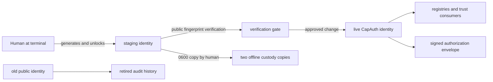

# Human identity setup, recovery, and key rotation

Status: operational runbook. Owner: the human identity holder. Applies to
classical CapAuth human identities used for signed approvals and operator
governance. This runbook follows the SK standards for provenance, reversible
mutation, backup/retention, testing evidence, and ITIL change control.

## 1. Purpose and invariants

- A human private key is generated and unlocked only by that human.
- Agents may prepare paths and verify public evidence, but never type, copy,
  print, or forge the human passphrase or private key.
- Rotation is additive first: retain the old public key and profile as audit
  history, enroll the new fingerprint, verify it, then retire old trust.
- Private keys and revocation certificates are `0600`; containing directories
  are `0700`. Public keys may be `0644`.
- Never paste key material or passphrases into chat, tickets, shell history,
  source control, logs, or command output.
- A backup is not accepted until its fingerprint and restore path are tested.

## 2. State and ownership



Canonical live home on the operator workstation is
`~/.skcapstone/capauth`. Temporary ceremony homes and home-directory backups
are transitional custody only and must be moved to two independent offline
media after acceptance.

## 3. Initial setup

The human runs key generation personally:

```bash
install -d -m 700 "$HOME/.chef-cauth-setup"
capauth --home "$HOME/.chef-cauth-setup" init \
  --name Chef --email chef@skworld.io --type human \
  --algorithm ed25519 --no-sync
```

Use a unique passphrase and retain it outside the workstation. Verify without
printing key contents:

```bash
capauth --home "$HOME/.chef-cauth-setup" profile verify
capauth --home "$HOME/.chef-cauth-setup" doctor custody --json
```

`doctor` will remain red until a matching revocation certificate and backup
exist. A red custody gate is not waived.

For a PGP-only installation that does not publish the Nextcloud app, explicitly
disable that integration check. The default remains required and invalid values
fail closed:

```bash
CAPAUTH_REQUIRE_NEXTCLOUD_SIGNING_KEY=false \
  capauth --home "$HOME/.chef-cauth-setup" doctor custody --json
```

The report marks a missing optional key as `WARN` and still fails on unsafe
permissions when a key is present. Use `--require-nextcloud-signing-key` or
the environment value `true` for installations that publish Nextcloud.

## 4. Revocation certificate and custody copies

The human imports the staged key into an isolated temporary GnuPG home and
runs `gpg --gen-revoke <fingerprint>`. Creating the certificate does not revoke
the key. Store the resulting `root-revocation.asc` beside each protected
private-key custody copy. Confirm:

```bash
stat -c '%a %U %G %n' \
  "$HOME/.chef-cauth-setup/identity/private.asc" \
  "$HOME/.chef-cauth-setup/identity/root-revocation.asc"
```

Expected mode is `600`. Maintain two independent offline copies. An on-host
backup is only a transfer/staging copy, not the required 3-2-1 end state.

## 5. Rotation workflow

1. Open an ITIL change with old fingerprint, reason, affected trust surfaces,
   maintenance window, verification plan, and rollback target.
2. Snapshot the old public key, signed profile, custody declaration, and
   revocation certificate into an owner-only `retired-keys/` directory.
3. Generate the replacement in an isolated `0700` ceremony home.
4. Verify public/private/backup fingerprints are identical and the profile
   signature is valid.
5. Generate and duplicate the replacement revocation certificate.
6. Install the replacement keypair and profile with the modes in section 1.
7. Update explicit fingerprint bindings in registries. Do not use global text
   replacement; validate every target record before mutation.
8. Run a fresh public-state backup and its restore verification.
9. Run `capauth doctor custody`; all mandatory checks must be `OK`.
10. Produce a signed, short-lived authorization and verify it through the real
    consuming workflow.
11. Keep both public fingerprints during the declared grace period. Revoke the
    old key only for compromise; an unavailable secret is retired, not falsely
    claimed revoked.

## 6. Signed approval ceremony

For an ATLAS/CMDB change, the authorization binds decision, target, change,
scope, expiry, nonce, signer fingerprint, and role:

```bash
skcapstone itil cab authorize CHANGE_ID \
  --decision approved --target TARGET --scope SCOPE \
  --output "$HOME/.skcapstone/authorizations/CHANGE_ID.json"
skcapstone itil cab vote CHANGE_ID \
  --decision approved \
  --authorization "$HOME/.skcapstone/authorizations/CHANGE_ID.json" \
  --target TARGET --scope SCOPE
```

Read the folded change back. The named human, authenticated role,
fingerprint, authorization ID, target, and scope must all match. Authorization
does not bypass freeze, maintenance-window, evidence, or rollback gates.

## 7. Verification and rollback

Acceptance evidence:

```bash
capauth --home "$HOME/.skcapstone/capauth" profile verify
capauth --home "$HOME/.skcapstone/capauth" doctor custody --json
capauth manifest verify-all
```

If any check fails, stop consumers, restore the prior public/profile state from
the named rollback directory, restore the previous registry fingerprint, and
rerun the same checks. Never delete the failed replacement; quarantine it with
its evidence and record the reversing event on the ITIL change.

## 8. Ongoing management

- Daily: custody doctor and backup freshness through the wrapped scheduler.
- Monthly: verify permissions, registry fingerprint parity, and restore the
  newest public-state backup into a temporary directory.
- Quarterly: verify both offline custody media and revocation-certificate
  readability; do not import the private key during routine inspection.
- Before each approval: verify profile signature and exact action/change/scope.
- On suspected compromise: freeze ATLAS, publish the held revocation
  certificate, invalidate affected grants, rotate, and open an incident/problem.

## 9. Evidence, records, and prohibited shortcuts

Record fingerprints, timestamps, modes, doctor results, backup artifact ID,
change ID, and verification outcome. Never record passphrases or private-key
content. Prohibited shortcuts include agent-generated human keys, reusing an
agent key as a person, unsigned votes, copying secrets through chat, accepting
a mismatched backup, or deleting old identity history to make checks green.

## 10. Verified 2026-08-20 Chef rotation and follow-up

The governed recovery ceremony replaced the unavailable prior Chef signing key
with fingerprint `ADAD14CCAC8D6D0BF5A4209DB994E78200BF6422`. The prior public
identity was retained under the owner-only `retired-keys/` history, the live
registry was updated additively, a fresh public-state backup was restore-tested,
and `capauth doctor custody` passed. The authenticated authorization for change
`chg-a543c87b` was consumed once and the canonical ITIL fold reported the change
approved. The fleet `_freeze.json` and `_protected.json` plane files were then
signed and verified against the new Chef key; signing did not unfreeze ATLAS.

During the plane-signing ceremony, the passphrase was accidentally disclosed in
terminal/chat history and briefly materialized as a plaintext filename. The file
was securely removed, but deletion does not make a disclosed secret private
again. Rotation was explicitly deferred by the owner and is tracked as high
priority card `da8a6401`. Until that card closes:

- never copy the disclosed value into tickets, documentation, commands, or new
  configuration;
- use hidden interactive input only when a governed signing ceremony is
  unavoidable;
- do not claim the passphrase is uncompromised; and
- preserve the same fingerprint during passphrase-only re-protection unless a
  full key rotation is independently required.

The command anti-pattern was `echo SECRET > $CAPAUTH_PASSPHRASE`: shell
redirection treats the expanded secret as a path, while the signer expects the
environment variable itself to contain the secret. The supported pattern is a
hidden prompt followed by a short-lived exported variable, immediate `unset`,
and no shell tracing. No secret literal belongs in this runbook.
