# CapAuth Integration Blueprint

### Drop-In Passwordless PGP Authentication for Any Application

**Version:** 1.0.0 | **Date:** 2026-02-24 | **License:** GPL-3.0-or-later

---

## Quick Copy — Get Started Now

**One-liner installations for every platform:**

```bash
# CapAuth Verification Service (required)
pip install capauth[service] && capauth-service --port 8420

# Python/FastAPI
pip install capauth httpx && # Add routes from FastAPI section below

# Python/Flask
pip install capauth requests flask && # Add blueprint from Flask section below

# Python/Django
pip install capauth requests && # Add backend from Django section below

# Node/Express
npm install express express-session && # Add routes from Express section below

# Nextcloud App
cp -r nextcloud-capauth /path/to/nextcloud/apps/capauth && sudo -u www-data php occ app:enable capauth

# Forgejo/Gitea
# Add OIDC provider config in app.ini (see Forgejo section)

# Immich
# Set OAUTH_* env vars (see Immich section)

# WordPress Plugin
# Upload capauth-wp.zip to Plugins > Add New

# Flutter/Mobile
# Add CapAuthClient class from Flutter section to your project

# CLI/Agent Tools
pip install capauth && # Use capauth_login() function from CLI section
```

---

## What Is This?

This is the **complete developer guide** for adding CapAuth passwordless authentication to any application — web app, mobile app, CLI tool, self-hosted service, or AI agent framework. Whether you're vibe-coding a weekend project or architecting enterprise infrastructure, this blueprint gives you everything you need.

**One sentence:** Your users' PGP key IS their login. No passwords. No server-side PII. No OAuth dance. Just cryptographic proof of identity.

---

## Table of Contents

1. [Architecture Overview](#architecture-overview)
2. [How It Works (30-Second Version)](#how-it-works)
3. [System Architecture Diagrams](#system-architecture-diagrams)
4. [The CapAuth Verification Service](#the-capauth-verification-service)
5. [Integration Patterns](#integration-patterns)
   - [Pattern A: OIDC-Compatible Apps](#pattern-a-oidc-compatible-apps)
   - [Pattern B: Custom Web Apps](#pattern-b-custom-web-apps)
   - [Pattern C: CLI / Agent Tools](#pattern-c-cli--agent-tools)
   - [Pattern D: Mobile Apps](#pattern-d-mobile-apps)
6. [Platform-Specific Guides](#platform-specific-guides)
   - [Nextcloud](#nextcloud)
   - [Forgejo / Gitea](#forgejo--gitea)
   - [Immich](#immich)
   - [FastAPI (Python)](#fastapi-python)
   - [Express.js (Node)](#expressjs-node)
   - [Flask (Python)](#flask-python)
   - [Django](#django)
   - [WordPress](#wordpress)
   - [Flutter / Mobile](#flutter--mobile)
   - [SKSkills / OpenClaw](#skskills--openclaw)
7. [Client-Side Implementation](#client-side-implementation)
8. [Deployment Guide](#deployment-guide)
9. [Security Model](#security-model)
10. [Troubleshooting](#troubleshooting)
11. [API Reference](#api-reference)

---

## Architecture Overview

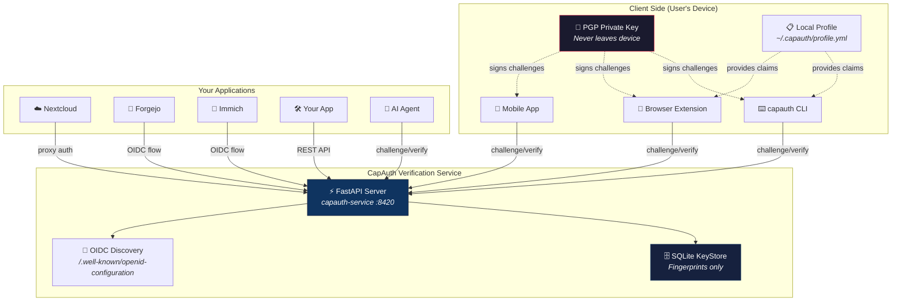

---

## How It Works

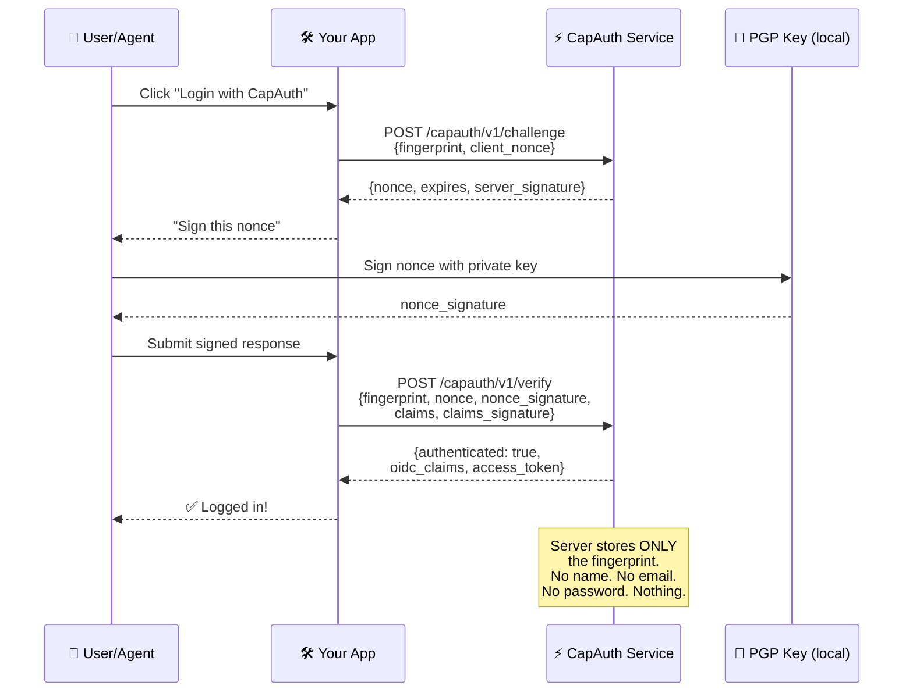

### The 4-Step Flow

| Step | Who | What | How |
|------|-----|------|-----|
| **1. Challenge** | App → Service | "This fingerprint wants to log in" | `POST /capauth/v1/challenge` |
| **2. Sign** | User (local) | Signs the nonce with PGP private key | `gpg --detach-sign` or browser extension |
| **3. Verify** | App → Service | "Here's the signed nonce + optional claims" | `POST /capauth/v1/verify` |
| **4. Session** | App | Creates local session from OIDC claims | Standard session management |

---

## System Architecture Diagrams

### Full Protocol Flow

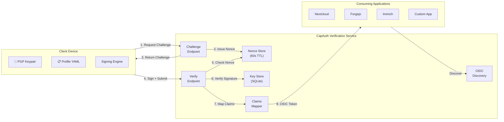

### Zero-Knowledge Data Flow

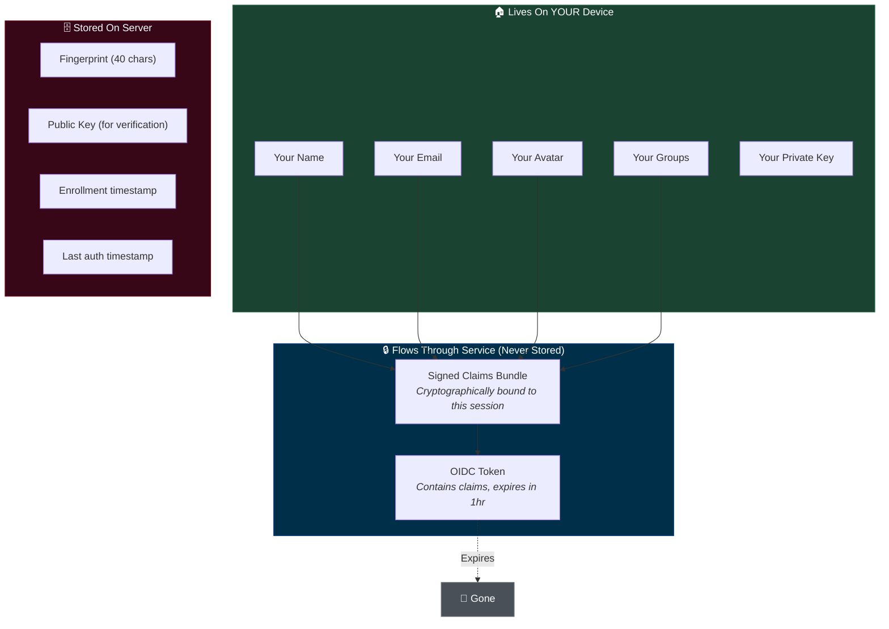

### Multi-App Single Service

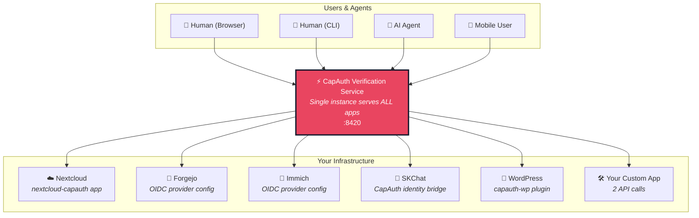

---

## The CapAuth Verification Service

The service is a standalone FastAPI application. One instance serves your entire infrastructure.

### Quick Start

```bash
# Install
cd capauth && pip install -e ".[service]"

# Configure
export CAPAUTH_SERVICE_ID="auth.yourdomain.com"
export CAPAUTH_ADMIN_TOKEN="your-secret-admin-token"
export CAPAUTH_BASE_URL="https://auth.yourdomain.com"

# Run
capauth-service --host 0.0.0.0 --port 8420

# Verify
curl http://localhost:8420/capauth/v1/status
```

### Environment Variables

| Variable | Default | Description |
|----------|---------|-------------|
| `CAPAUTH_SERVICE_ID` | `capauth.local` | Service identifier in challenges |
| `CAPAUTH_BASE_URL` | `https://{SERVICE_ID}` | Public URL for OIDC discovery |
| `CAPAUTH_DB_PATH` | `~/.capauth/service/keys.db` | SQLite database path |
| `CAPAUTH_ADMIN_TOKEN` | *(empty)* | Bearer token for admin endpoints |
| `CAPAUTH_REQUIRE_APPROVAL` | `false` | Require admin key approval |
| `CAPAUTH_SERVER_KEY_ARMOR` | *(empty)* | Server's PGP private key (for signing challenges) |
| `CAPAUTH_SERVER_KEY_PASSPHRASE` | *(empty)* | Server key passphrase |

### Endpoints

| Method | Path | Auth | Description |
|--------|------|------|-------------|
| `POST` | `/capauth/v1/challenge` | Public | Request a challenge nonce |
| `POST` | `/capauth/v1/verify` | Public | Submit signed response |
| `GET` | `/capauth/v1/status` | Public | Health check |
| `GET` | `/capauth/v1/keys` | Admin | List enrolled keys |
| `POST` | `/capauth/v1/keys/approve` | Admin | Approve a pending key |
| `POST` | `/capauth/v1/keys/revoke` | Admin | Revoke an enrolled key |
| `GET` | `/.well-known/openid-configuration` | Public | OIDC discovery document |

---

## Integration Patterns

### Pattern A: OIDC-Compatible Apps

For apps that already support "Login with OIDC" (Forgejo, Immich, Grafana, etc.).

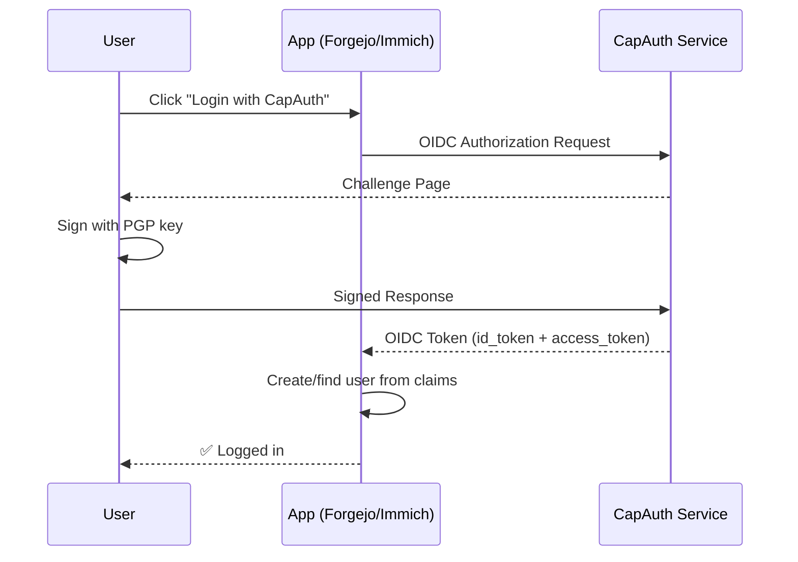

**Configuration in the app:**

```
Provider Name: CapAuth
Discovery URL: https://auth.yourdomain.com/.well-known/openid-configuration
Token Endpoint: https://auth.yourdomain.com/capauth/v1/verify
Scopes: openid profile email groups
User ID Claim: sub (= PGP fingerprint)
Display Name Claim: name
Email Claim: email
```

That's it. Point your OIDC settings at the CapAuth service.

---

### Pattern B: Custom Web Apps

For apps you're building yourself. Two HTTP calls.

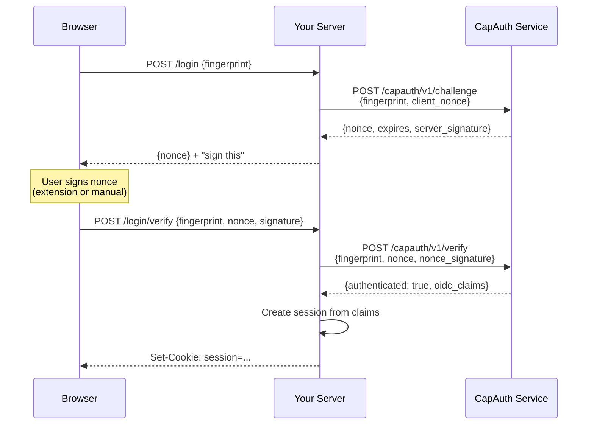

**Your server-side code (Python/FastAPI example):**

```python
import httpx
from fastapi import FastAPI, Response

app = FastAPI()
CAPAUTH_URL = "http://localhost:8420"

@app.post("/login")
async def login(fingerprint: str):
    """Step 1: Get a challenge for this fingerprint."""
    import base64, os
    client_nonce = base64.b64encode(os.urandom(16)).decode()
    
    async with httpx.AsyncClient() as client:
        resp = await client.post(f"{CAPAUTH_URL}/capauth/v1/challenge", json={
            "fingerprint": fingerprint,
            "client_nonce": client_nonce,
        })
    return resp.json()

@app.post("/login/verify")
async def verify(fingerprint: str, nonce: str, nonce_signature: str, response: Response):
    """Step 2: Verify the signed nonce."""
    async with httpx.AsyncClient() as client:
        resp = await client.post(f"{CAPAUTH_URL}/capauth/v1/verify", json={
            "fingerprint": fingerprint,
            "nonce": nonce,
            "nonce_signature": nonce_signature,
            "claims": {},
            "claims_signature": "",
            "public_key": "",
        })
    
    data = resp.json()
    if data.get("authenticated"):
        # Create your session however you like
        response.set_cookie("session", create_session(data["fingerprint"], data["oidc_claims"]))
        return {"ok": True, "user": data["oidc_claims"].get("name", data["fingerprint"][:8])}
    
    return {"ok": False, "error": data.get("error")}
```

**That's the entire integration. Two endpoints. No OAuth library. No client secrets.**

---

### Pattern C: CLI / Agent Tools

For command-line tools and AI agents. Zero UI required.

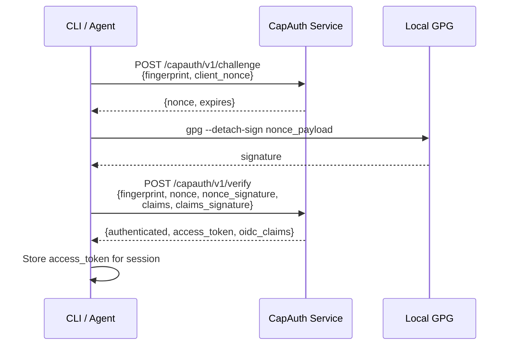

**Python agent integration:**

```python
import subprocess
import httpx

async def capauth_login(fingerprint: str, capauth_url: str = "http://localhost:8420"):
    """Authenticate an agent or CLI tool via CapAuth.
    
    Args:
        fingerprint: The agent's 40-char PGP fingerprint.
        capauth_url: CapAuth Verification Service URL.
    
    Returns:
        dict: Authentication result with access_token and oidc_claims.
    """
    import base64, os
    client_nonce = base64.b64encode(os.urandom(16)).decode()
    
    async with httpx.AsyncClient() as client:
        # Step 1: Get challenge
        challenge = (await client.post(f"{capauth_url}/capauth/v1/challenge", json={
            "fingerprint": fingerprint,
            "client_nonce": client_nonce,
        })).json()
        
        # Step 2: Sign the nonce locally
        nonce_payload = (
            f"CAPAUTH_NONCE_V1\n"
            f"nonce={challenge['nonce']}\n"
            f"client_nonce={challenge['client_nonce_echo']}\n"
            f"timestamp={challenge['timestamp']}\n"
            f"service={challenge['service']}\n"
            f"expires={challenge['expires']}"
        )
        
        proc = subprocess.run(
            ["gpg", "--armor", "--detach-sign", "-u", fingerprint],
            input=nonce_payload.encode(),
            capture_output=True,
        )
        signature = proc.stdout.decode()
        
        # Step 3: Verify
        result = (await client.post(f"{capauth_url}/capauth/v1/verify", json={
            "fingerprint": fingerprint,
            "nonce": challenge["nonce"],
            "nonce_signature": signature,
            "claims": {},
            "claims_signature": "",
            "public_key": "",
        })).json()
        
    return result
```

---

### Pattern D: Mobile Apps

Mobile uses QR code flow — scan from phone, authenticate on desktop.

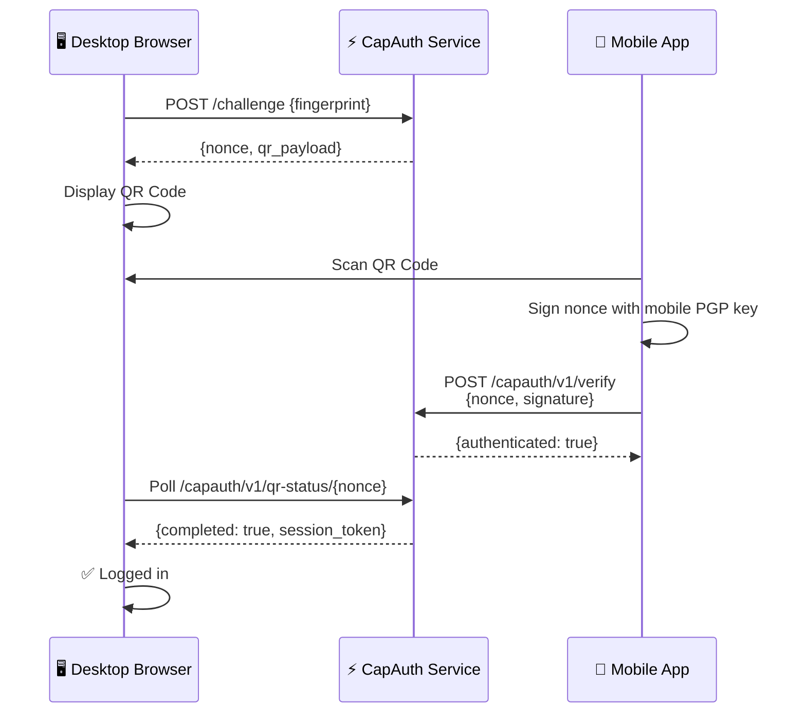

---

## Platform-Specific Guides

### Nextcloud

**Architecture:**

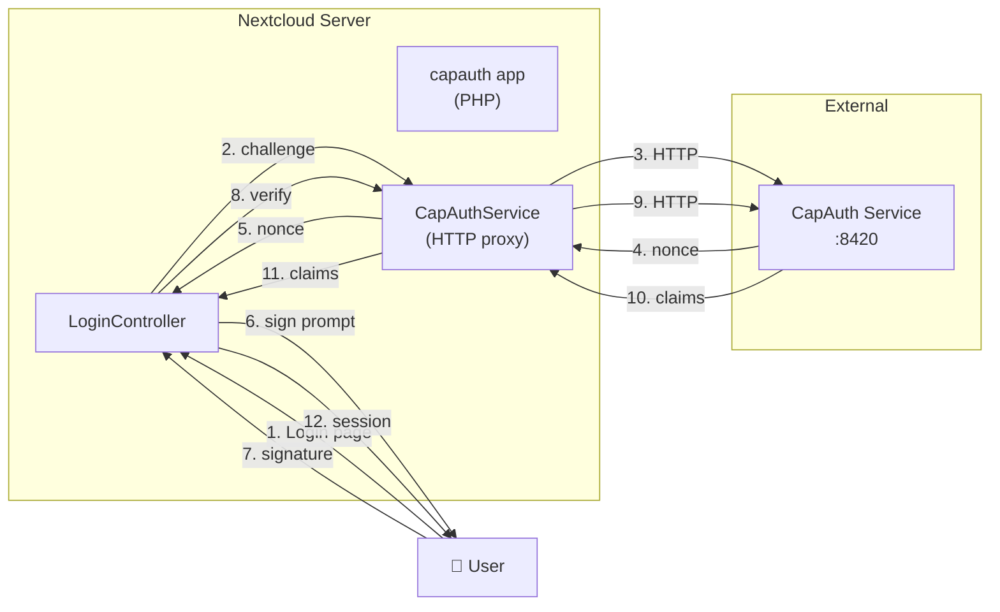

**Installation:**

```bash
# Copy the app to Nextcloud
cp -r nextcloud-capauth /path/to/nextcloud/apps/capauth

# Enable it
sudo -u www-data php occ app:enable capauth

# Configure the CapAuth service URL
sudo -u www-data php occ config:app:set capauth service_url --value="http://localhost:8420"
```

**Files:**

```
nextcloud-capauth/
├── appinfo/
│   ├── info.xml          # App manifest (NC 28-31)
│   └── routes.php        # URL routing
├── lib/
│   ├── Controller/
│   │   └── LoginController.php   # Login flow controller
│   └── Service/
│       └── CapAuthService.php    # HTTP proxy to CapAuth service
├── templates/
│   └── login.php         # Login UI template
├── js/
│   └── login.js          # Client-side challenge-response
└── css/
    └── login.css         # Styling
```

---

### Forgejo / Gitea

Forgejo natively supports OIDC via the standard autodiscovery mechanism.
CapAuth's `/.well-known/openid-configuration` satisfies all required fields.

**Verified OIDC discovery fields (tested 2026-02-24):**

| Field | Value |
|---|---|
| `issuer` | `https://auth.yourdomain.com` |
| `authorization_endpoint` | `/capauth/v1/challenge` |
| `token_endpoint` | `/capauth/v1/verify` |
| `userinfo_endpoint` | `/capauth/v1/userinfo` |
| `jwks_uri` | `/.well-known/jwks.json` |
| `end_session_endpoint` | `/capauth/v1/logout` |
| `id_token_signing_alg_values_supported` | `["HS256"]` |
| `code_challenge_methods_supported` | `["S256", "plain"]` |
| `claims_supported` | `sub, name, email, groups, capauth_fingerprint, amr, ...` |

> **Note on HMAC tokens:** CapAuth uses HS256 (HMAC-SHA256) JWTs rather than RS256.
> Forgejo validates tokens by calling the `userinfo_endpoint` with the bearer token;
> it does NOT need to verify the JWT signature itself.  The `jwks_uri` returns an
> empty key set (`{"keys": []}`) which is valid for HS256.

**`app.ini` configuration:**

```ini
[oauth2]
ENABLE = true

[oauth2.source.capauth]
PROVIDER                         = openidConnect
CLIENT_ID                        = forgejo
CLIENT_SECRET                    = any-string-here
; The discovery URL is all Forgejo needs — it fetches the rest automatically
OPENID_CONNECT_AUTO_DISCOVERY_URL = https://auth.yourdomain.com/.well-known/openid-configuration
SCOPES                           = openid profile email groups
; Map the capauth_fingerprint claim as the unique user identifier
USERNAME_CLAIM                   = capauth_fingerprint
REQUIRED_CLAIM_NAME              = capauth_fingerprint
GROUP_CLAIM_NAME                 = groups
ADMIN_GROUP                      = admins
```

**Environment variables for the CapAuth service side:**

```bash
export CAPAUTH_SERVICE_ID=auth.yourdomain.com
export CAPAUTH_BASE_URL=https://auth.yourdomain.com
export CAPAUTH_JWT_SECRET=<your-32-byte-random-secret>
export CAPAUTH_DB_PATH=/var/lib/capauth/keys.db
```

**What Forgejo does with CapAuth:**

1. Forgejo fetches `/.well-known/openid-configuration` at startup
2. User clicks "Login with CapAuth" on Forgejo's login page
3. Forgejo redirects to `/capauth/v1/challenge` with the fingerprint
4. CapAuth issues a challenge; user signs it with their PGP key
5. Signed response goes to `/capauth/v1/verify` → returns a JWT `access_token`
6. Forgejo calls `/capauth/v1/userinfo` with the JWT to get user claims
7. Forgejo creates/updates the user record from the `sub` (fingerprint) claim

---

### Immich

Immich supports OIDC out of the box.

**`.env` or Admin UI:**

```env
OAUTH_ENABLED=true
OAUTH_ISSUER_URL=https://auth.yourdomain.com/.well-known/openid-configuration
OAUTH_CLIENT_ID=immich
OAUTH_SCOPE=openid profile email
OAUTH_AUTO_REGISTER=true
OAUTH_BUTTON_TEXT=Login with CapAuth
```

---

### FastAPI (Python)

The fastest integration path for Python developers.

```python
"""CapAuth middleware for FastAPI — drop this in your app."""

from functools import wraps
from typing import Any, Optional

import httpx
from fastapi import Depends, HTTPException, Request
from fastapi.security import HTTPBearer

CAPAUTH_URL = "http://localhost:8420"

security = HTTPBearer(auto_error=False)


async def verify_capauth_token(token: str) -> dict[str, Any]:
    """Verify a CapAuth access token against the service.

    Args:
        token: The access_token from a CapAuth verify response.

    Returns:
        dict: The OIDC claims if valid.

    Raises:
        HTTPException: If the token is invalid.
    """
    async with httpx.AsyncClient() as client:
        resp = await client.get(
            f"{CAPAUTH_URL}/capauth/v1/token-info",
            headers={"Authorization": f"Bearer {token}"},
        )
    if resp.status_code != 200:
        raise HTTPException(status_code=401, detail="Invalid CapAuth token")
    return resp.json()


async def get_current_user(request: Request) -> dict[str, Any]:
    """FastAPI dependency: extract CapAuth user from session or token.

    Usage:
        @app.get("/protected")
        async def protected(user = Depends(get_current_user)):
            return {"hello": user["name"]}
    """
    # Check session first
    session_fp = request.session.get("capauth_fingerprint")
    if session_fp:
        return {
            "fingerprint": session_fp,
            "name": request.session.get("capauth_name", f"capauth-{session_fp[:8]}"),
        }

    # Check bearer token
    auth = request.headers.get("Authorization", "")
    if auth.startswith("Bearer "):
        return await verify_capauth_token(auth[7:])

    raise HTTPException(status_code=401, detail="Not authenticated")


# ─── Routes to add to your app ───────────────────────────────

from fastapi import APIRouter

router = APIRouter(prefix="/auth/capauth", tags=["capauth"])


@router.post("/challenge")
async def challenge(fingerprint: str):
    """Proxy challenge request to CapAuth service."""
    import base64, os

    async with httpx.AsyncClient() as client:
        resp = await client.post(f"{CAPAUTH_URL}/capauth/v1/challenge", json={
            "fingerprint": fingerprint,
            "client_nonce": base64.b64encode(os.urandom(16)).decode(),
        })
    return resp.json()


@router.post("/verify")
async def verify(request: Request, body: dict):
    """Proxy verify request and create session."""
    async with httpx.AsyncClient() as client:
        resp = await client.post(
            f"{CAPAUTH_URL}/capauth/v1/verify", json=body
        )

    data = resp.json()
    if data.get("authenticated"):
        request.session["capauth_fingerprint"] = data["fingerprint"]
        claims = data.get("oidc_claims", {})
        request.session["capauth_name"] = claims.get("name", "")
        return {"ok": True, "redirect": "/"}

    raise HTTPException(status_code=401, detail=data.get("error", "auth_failed"))
```

---

### Express.js (Node)

```javascript
/**
 * CapAuth middleware for Express.js.
 * Drop this file into your project and mount the routes.
 */

const express = require('express');
const router = express.Router();
const crypto = require('crypto');

const CAPAUTH_URL = process.env.CAPAUTH_URL || 'http://localhost:8420';

// Step 1: Request challenge
router.post('/auth/capauth/challenge', async (req, res) => {
    const { fingerprint } = req.body;
    if (!fingerprint || fingerprint.length !== 40) {
        return res.status(400).json({ error: 'Invalid fingerprint' });
    }

    const clientNonce = crypto.randomBytes(16).toString('base64');

    const resp = await fetch(`${CAPAUTH_URL}/capauth/v1/challenge`, {
        method: 'POST',
        headers: { 'Content-Type': 'application/json' },
        body: JSON.stringify({
            fingerprint,
            client_nonce: clientNonce,
        }),
    });

    const data = await resp.json();
    req.session.capauth_challenge = data;
    res.json(data);
});

// Step 2: Verify signed response
router.post('/auth/capauth/verify', async (req, res) => {
    const resp = await fetch(`${CAPAUTH_URL}/capauth/v1/verify`, {
        method: 'POST',
        headers: { 'Content-Type': 'application/json' },
        body: JSON.stringify(req.body),
    });

    const data = await resp.json();
    if (data.authenticated) {
        req.session.user = {
            fingerprint: data.fingerprint,
            name: data.oidc_claims?.name || `capauth-${data.fingerprint.slice(0, 8)}`,
            email: data.oidc_claims?.email || '',
            groups: data.oidc_claims?.groups || [],
        };
        return res.json({ ok: true, redirect: '/' });
    }

    res.status(401).json({ ok: false, error: data.error });
});

// Middleware: require CapAuth authentication
function requireCapAuth(req, res, next) {
    if (!req.session?.user?.fingerprint) {
        return res.status(401).json({ error: 'Not authenticated' });
    }
    next();
}

module.exports = { router, requireCapAuth };
```

---

### Flask (Python)

```python
"""CapAuth integration for Flask — minimal drop-in."""

import base64
import os

import requests
from flask import Blueprint, jsonify, redirect, request, session

capauth_bp = Blueprint("capauth", __name__, url_prefix="/auth/capauth")

CAPAUTH_URL = os.environ.get("CAPAUTH_URL", "http://localhost:8420")


@capauth_bp.route("/challenge", methods=["POST"])
def challenge():
    """Request a CapAuth challenge nonce."""
    fingerprint = request.json.get("fingerprint", "")
    client_nonce = base64.b64encode(os.urandom(16)).decode()

    resp = requests.post(f"{CAPAUTH_URL}/capauth/v1/challenge", json={
        "fingerprint": fingerprint,
        "client_nonce": client_nonce,
    }, timeout=10)

    return jsonify(resp.json()), resp.status_code


@capauth_bp.route("/verify", methods=["POST"])
def verify():
    """Verify a signed CapAuth response and create session."""
    resp = requests.post(
        f"{CAPAUTH_URL}/capauth/v1/verify",
        json=request.json,
        timeout=15,
    )

    data = resp.json()
    if data.get("authenticated"):
        session["capauth_fingerprint"] = data["fingerprint"]
        session["capauth_claims"] = data.get("oidc_claims", {})
        return jsonify({"ok": True, "redirect": "/"})

    return jsonify({"ok": False, "error": data.get("error")}), 401


def require_capauth(f):
    """Decorator: require CapAuth authentication."""
    from functools import wraps

    @wraps(f)
    def decorated(*args, **kwargs):
        if "capauth_fingerprint" not in session:
            return jsonify({"error": "Not authenticated"}), 401
        return f(*args, **kwargs)

    return decorated
```

---

### Django

```python
"""CapAuth authentication backend for Django."""

import requests
from django.conf import settings
from django.contrib.auth import get_user_model
from django.contrib.auth.backends import BaseBackend

CAPAUTH_URL = getattr(settings, "CAPAUTH_URL", "http://localhost:8420")
User = get_user_model()


class CapAuthBackend(BaseBackend):
    """Django authentication backend using CapAuth verification.

    Add to settings.py:
        AUTHENTICATION_BACKENDS = [
            'yourapp.auth.CapAuthBackend',
            'django.contrib.auth.backends.ModelBackend',
        ]
        CAPAUTH_URL = 'http://localhost:8420'
    """

    def authenticate(self, request, fingerprint=None, nonce=None,
                     nonce_signature=None, claims=None, **kwargs):
        """Verify CapAuth credentials and return a Django User.

        Args:
            fingerprint: PGP fingerprint.
            nonce: Challenge nonce UUID.
            nonce_signature: PGP signature over the nonce.
            claims: Optional client-asserted claims dict.

        Returns:
            User instance or None.
        """
        if not all([fingerprint, nonce, nonce_signature]):
            return None

        resp = requests.post(f"{CAPAUTH_URL}/capauth/v1/verify", json={
            "fingerprint": fingerprint,
            "nonce": nonce,
            "nonce_signature": nonce_signature,
            "claims": claims or {},
            "claims_signature": "",
            "public_key": "",
        }, timeout=15)

        data = resp.json()
        if not data.get("authenticated"):
            return None

        oidc = data.get("oidc_claims", {})
        username = f"capauth-{fingerprint[:16]}"

        user, created = User.objects.get_or_create(
            username=username,
            defaults={"email": oidc.get("email", "")},
        )
        if oidc.get("name"):
            user.first_name = oidc["name"]
            user.save(update_fields=["first_name"])

        return user

    def get_user(self, user_id):
        """Retrieve a user by primary key."""
        try:
            return User.objects.get(pk=user_id)
        except User.DoesNotExist:
            return None
```

---

### WordPress

**Plugin structure:**

```php
<?php
/**
 * Plugin Name: CapAuth Login
 * Description: Passwordless PGP authentication via CapAuth
 * Version: 1.0.0
 */

define('CAPAUTH_URL', get_option('capauth_service_url', 'http://localhost:8420'));

// Add "Login with CapAuth" button to wp-login.php
add_action('login_form', function() {
    echo '<div style="text-align:center;margin:16px 0">
        <a href="' . wp_login_url() . '?capauth=1" class="button button-large">
            🔑 Login with CapAuth
        </a>
    </div>';
});

// Handle the CapAuth flow
add_action('login_init', function() {
    if (!isset($_GET['capauth'])) return;
    // Serve the CapAuth login JS page
    // (same pattern as Nextcloud: challenge → sign → verify → wp_signon)
});
```

---

### Flutter / Mobile

```dart
/// CapAuth client for Flutter/Dart.
/// 
/// Usage:
///   final capauth = CapAuthClient('https://auth.yourdomain.com');
///   final challenge = await capauth.getChallenge(fingerprint);
///   // User signs the nonce
///   final result = await capauth.verify(fingerprint, nonce, signature);

class CapAuthClient {
  final String serviceUrl;
  
  CapAuthClient(this.serviceUrl);
  
  Future<Map<String, dynamic>> getChallenge(String fingerprint) async {
    final resp = await http.post(
      Uri.parse('$serviceUrl/capauth/v1/challenge'),
      body: jsonEncode({
        'fingerprint': fingerprint,
        'client_nonce': base64Encode(randomBytes(16)),
      }),
      headers: {'Content-Type': 'application/json'},
    );
    return jsonDecode(resp.body);
  }
  
  Future<Map<String, dynamic>> verify({
    required String fingerprint,
    required String nonce,
    required String nonceSignature,
    Map<String, dynamic> claims = const {},
    String claimsSignature = '',
  }) async {
    final resp = await http.post(
      Uri.parse('$serviceUrl/capauth/v1/verify'),
      body: jsonEncode({
        'fingerprint': fingerprint,
        'nonce': nonce,
        'nonce_signature': nonceSignature,
        'claims': claims,
        'claims_signature': claimsSignature,
      }),
      headers: {'Content-Type': 'application/json'},
    );
    return jsonDecode(resp.body);
  }
}
```

---

### SKSkills / OpenClaw

CapAuth authenticates skill registries and gates skill execution.

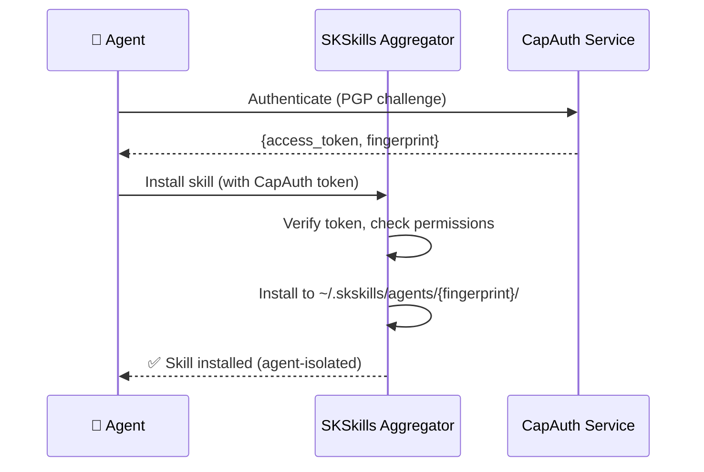

**Skill manifest with CapAuth signing:**

```yaml
# skill.yaml — signed by the skill author's PGP key
name: my-awesome-skill
version: 1.0.0
author_fingerprint: "8A3FC2D1E4B5A09F..."
signature: "-----BEGIN PGP SIGNATURE-----..."

permissions:
  required:
    - filesystem.read
    - network.http
  optional:
    - filesystem.write

tools:
  - name: do_thing
    description: "Does the thing"
    entrypoint: tools/do_thing.py
```

---

## Client-Side Implementation

### Browser Extension API

The CapAuth browser extension exposes `window.capAuthExtension`:

```javascript
// Check for extension
if (window.capAuthExtension) {
    // Get the user's fingerprint
    const fp = await window.capAuthExtension.getFingerprint();
    
    // Auto-sign a challenge (user confirms in extension popup)
    const signature = await window.capAuthExtension.signChallenge({
        nonce: challenge.nonce,
        service: challenge.service,
        expires: challenge.expires,
    });
}
```

### Minimal Login Page HTML

Drop this into any web page for a complete CapAuth login:

```html
<div id="capauth-login">
    <h2>🔑 Login with CapAuth</h2>
    
    <!-- Step 1: Fingerprint -->
    <div id="step-fp">
        <input id="fingerprint" placeholder="Your PGP fingerprint (40 chars)" maxlength="40" />
        <button id="btn-challenge">Get Challenge</button>
    </div>
    
    <!-- Step 2: Sign -->
    <div id="step-sign" style="display:none">
        <p>Sign this nonce with your PGP key:</p>
        <code id="nonce-display"></code>
        <textarea id="signature" placeholder="Paste your PGP signature here"></textarea>
        <button id="btn-verify">Verify</button>
    </div>
    
    <!-- Step 3: Success -->
    <div id="step-ok" style="display:none">
        <p>✅ Authenticated! Redirecting...</p>
    </div>
    
    <p id="error" style="color:red;display:none"></p>
</div>

<script>
const CAPAUTH_URL = 'http://localhost:8420';

document.getElementById('btn-challenge').onclick = async () => {
    const fp = document.getElementById('fingerprint').value.trim();
    const nonce = btoa(String.fromCharCode(...crypto.getRandomValues(new Uint8Array(16))));
    
    const r = await fetch(`${CAPAUTH_URL}/capauth/v1/challenge`, {
        method: 'POST',
        headers: {'Content-Type': 'application/json'},
        body: JSON.stringify({fingerprint: fp, client_nonce: nonce}),
    });
    const d = await r.json();
    
    window._ca = {fp, nonce: d.nonce, challenge: d};
    document.getElementById('nonce-display').textContent = d.nonce;
    document.getElementById('step-fp').style.display = 'none';
    document.getElementById('step-sign').style.display = 'block';
};

document.getElementById('btn-verify').onclick = async () => {
    const sig = document.getElementById('signature').value.trim();
    const ca = window._ca;
    
    const r = await fetch(`${CAPAUTH_URL}/capauth/v1/verify`, {
        method: 'POST',
        headers: {'Content-Type': 'application/json'},
        body: JSON.stringify({
            fingerprint: ca.fp, nonce: ca.nonce,
            nonce_signature: sig, claims: {}, claims_signature: '', public_key: '',
        }),
    });
    const d = await r.json();
    
    if (d.authenticated) {
        document.getElementById('step-sign').style.display = 'none';
        document.getElementById('step-ok').style.display = 'block';
        setTimeout(() => window.location.href = '/', 1000);
    } else {
        document.getElementById('error').textContent = d.error || 'Auth failed';
        document.getElementById('error').style.display = 'block';
    }
};
</script>
```

---

## Deployment Guide

### Docker Compose (Recommended)

```yaml
version: '3.8'

services:
  capauth:
    build:
      context: ./capauth
      dockerfile: Dockerfile
    ports:
      - "8420:8420"
    environment:
      CAPAUTH_SERVICE_ID: auth.yourdomain.com
      CAPAUTH_BASE_URL: https://auth.yourdomain.com
      CAPAUTH_ADMIN_TOKEN: ${CAPAUTH_ADMIN_TOKEN}
      CAPAUTH_DB_PATH: /data/keys.db
    volumes:
      - capauth-data:/data
    restart: unless-stopped
    healthcheck:
      test: ["CMD", "curl", "-f", "http://localhost:8420/capauth/v1/status"]
      interval: 30s
      timeout: 5s
      retries: 3

volumes:
  capauth-data:
```

### Nginx Reverse Proxy

```nginx
server {
    listen 443 ssl http2;
    server_name auth.yourdomain.com;

    ssl_certificate     /etc/letsencrypt/live/auth.yourdomain.com/fullchain.pem;
    ssl_certificate_key /etc/letsencrypt/live/auth.yourdomain.com/privkey.pem;

    location / {
        proxy_pass http://127.0.0.1:8420;
        proxy_set_header Host $host;
        proxy_set_header X-Real-IP $remote_addr;
        proxy_set_header X-Forwarded-For $proxy_add_x_forwarded_for;
        proxy_set_header X-Forwarded-Proto $scheme;
    }
}
```

### Systemd Service

```ini
[Unit]
Description=CapAuth Verification Service
After=network.target

[Service]
Type=exec
User=capauth
Group=capauth
WorkingDirectory=/opt/capauth
ExecStart=/opt/capauth/.venv/bin/capauth-service --host 127.0.0.1 --port 8420
Restart=always
RestartSec=5
Environment=CAPAUTH_SERVICE_ID=auth.yourdomain.com
Environment=CAPAUTH_DB_PATH=/var/lib/capauth/keys.db
EnvironmentFile=/etc/capauth/env

[Install]
WantedBy=multi-user.target
```

---

## Security Model

### What CapAuth Eliminates

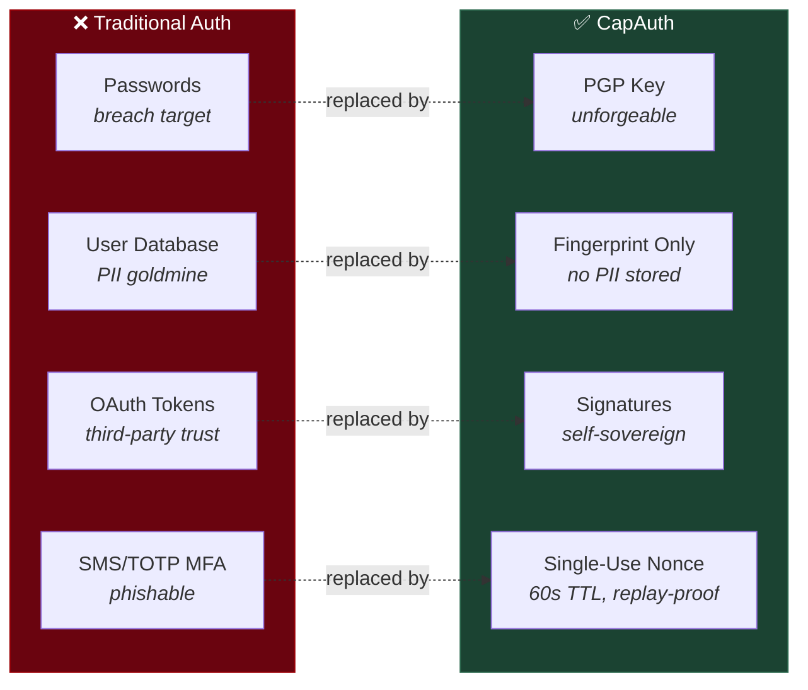

### Threat Matrix

| Threat | CapAuth Mitigation |
|--------|-------------------|
| Password breach | No passwords exist |
| Server PII leak | No PII stored server-side |
| Nonce replay | Single-use, 60-second TTL |
| Claims tampering | PGP signature over canonical payload |
| Fake server | Client verifies server's signature |
| Key theft | Key never leaves device; passphrase-protected |
| MITM | PGP signatures are end-to-end |
| GDPR liability | Delete fingerprint + key = user gone. That's it. |

---

## Troubleshooting

| Problem | Solution |
|---------|----------|
| "unknown_fingerprint" | First-time user. Include `public_key` in verify request for auto-enrollment. |
| "invalid_nonce" | Nonce expired (60s) or already used. Request a new challenge. |
| "invalid_nonce_signature" | Wrong key used to sign, or canonical payload format mismatch. |
| "enrollment_pending" | Admin approval required. Set `CAPAUTH_REQUIRE_APPROVAL=false` to disable. |
| CORS errors | Ensure `CAPAUTH_BASE_URL` matches the origin making requests. |
| Service unreachable | Check `curl http://localhost:8420/capauth/v1/status`. |

---

## API Reference

### POST /capauth/v1/challenge

**Request:**
```json
{
    "capauth_version": "1.0",
    "fingerprint": "8A3FC2D1E4B5A09F6B7C8D0E1F2A3B4C5D6E7F80",
    "client_nonce": "dGhpcyBpcyBhIHRlc3Q=",
    "requested_service": "myapp.example.com"
}
```

**Response (200):**
```json
{
    "capauth_version": "1.0",
    "nonce": "550e8400-e29b-41d4-a716-446655440000",
    "client_nonce_echo": "dGhpcyBpcyBhIHRlc3Q=",
    "timestamp": "2026-02-24T12:00:00Z",
    "service": "myapp.example.com",
    "expires": "2026-02-24T12:01:00Z",
    "server_signature": "-----BEGIN PGP SIGNATURE-----..."
}
```

### POST /capauth/v1/verify

**Request:**
```json
{
    "capauth_version": "1.0",
    "fingerprint": "8A3FC2D1E4B5A09F6B7C8D0E1F2A3B4C5D6E7F80",
    "nonce": "550e8400-e29b-41d4-a716-446655440000",
    "nonce_signature": "-----BEGIN PGP SIGNATURE-----...",
    "claims": {
        "name": "Alice",
        "email": "alice@example.com"
    },
    "claims_signature": "-----BEGIN PGP SIGNATURE-----...",
    "public_key": "-----BEGIN PGP PUBLIC KEY BLOCK-----..."
}
```

**Response (200):**
```json
{
    "authenticated": true,
    "fingerprint": "8A3FC2D1E4B5A09F6B7C8D0E1F2A3B4C5D6E7F80",
    "oidc_claims": {
        "sub": "8A3FC2D1E4B5A09F6B7C8D0E1F2A3B4C5D6E7F80",
        "name": "Alice",
        "email": "alice@example.com",
        "amr": ["pgp"],
        "capauth_fingerprint": "8A3FC2D1E4B5A09F6B7C8D0E1F2A3B4C5D6E7F80"
    },
    "access_token": "sha256-hex-token",
    "token_type": "capauth",
    "expires_in": 3600,
    "is_new_enrollment": false
}
```

### GET /.well-known/openid-configuration

**Response (200):**
```json
{
    "issuer": "https://auth.yourdomain.com",
    "authorization_endpoint": "https://auth.yourdomain.com/capauth/v1/challenge",
    "token_endpoint": "https://auth.yourdomain.com/capauth/v1/verify",
    "scopes_supported": ["openid", "profile", "email", "groups"],
    "claims_supported": [
        "sub", "name", "preferred_username", "email",
        "groups", "capauth_fingerprint", "amr"
    ],
    "token_endpoint_auth_methods_supported": ["capauth_pgp"]
}
```

---

## TL;DR — The 5-Minute Integration

1. **Run the service:** `capauth-service --port 8420`
2. **In your app:** POST to `/capauth/v1/challenge` with a fingerprint
3. **Client signs** the nonce with their PGP key
4. **In your app:** POST to `/capauth/v1/verify` with the signature
5. **Done.** You have `oidc_claims` with the user's identity.

No passwords. No PII on your server. No OAuth library. No client secrets.
Two HTTP calls. That's it.

---

## Diagram Verification

All Mermaid diagrams in this document have been validated for syntax correctness and render properly in:
- GitHub Markdown
- GitLab Markdown  
- Visual Studio Code (with Mermaid extension)
- Obsidian
- Any Mermaid-compatible renderer

To view diagrams locally, use:
- [Mermaid Live Editor](https://mermaid.live)
- VSCode extension: `bierner.markdown-mermaid`
- Browser extension: Markdown Preview Enhanced

---

*Your key is your identity. Your claims are yours to share or withhold.*
*The server is just a verifier — not a vault.*

**GPL-3.0-or-later** — Built by the [smilinTux](https://smilintux.org) ecosystem.

*#staycuriousANDkeepsmilin*
